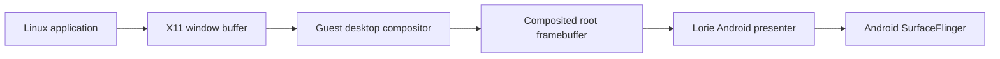
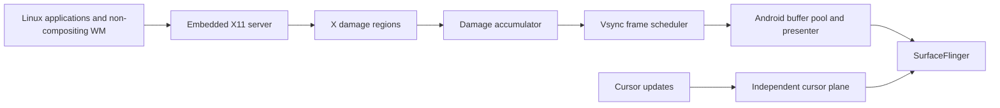
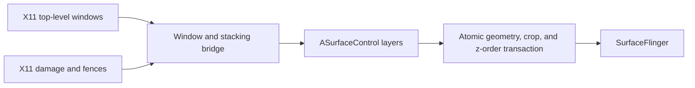
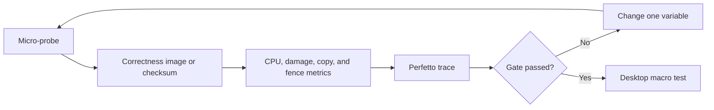

# Android-aware display presenter plan

Status: proposal

Date: 2026-07-26

## Purpose

uDroid currently embeds the Termux:X11 Lorie server and displays the Linux
desktop through an Android `SurfaceView`. That is a sound foundation, but a
traditional Linux desktop compositor can still be expensive in a PRoot
environment, especially when the guest falls back to software rendering.

This plan improves the layer between the X11 desktop and Android. The first
target is an efficient single-surface presenter whose work is proportional to
the pixels that changed. A more ambitious per-window Android surface bridge is
kept as a measured follow-up, not assumed to be necessary from the beginning.

This work belongs to uDroid's embedded X11 integration. It is not a proposal to
change the behavior of the standalone Termux:X11 application.

Companion documents:

- [Embedded X11 runtime architecture](X11_RUNTIME_ARCHITECTURE.md)
- [Desktop input and session roadmap](DESKTOP_INPUT_AND_SESSION_ROADMAP.md)
- [Performance methodology](PERFORMANCE.md)

## The problem

A conventional X11 desktop with compositing can perform several stages of work
for one visible update:

When the guest compositor is software-rendered, it may blend and copy a
full-screen image even if only a menu, cursor, or small window region changed.
The Android presenter can then copy or upload that result again.

At 1080 × 2400, one RGBA frame is about 10.4 MB. One full-frame pass at 60 Hz
is approximately 622 MB/s, or 593 MiB/s. Multiple full-frame passes can consume
significant memory bandwidth and CPU time before Android performs its own final
composition.

Detecting a renderer such as Panfrost or llvmpipe does not prove that this
presentation path is efficient. Rendering, synchronization, buffer ownership,
and display are separate costs and must be measured separately.

## Goals

- Make software-rendered desktops responsive, particularly XFCE, MATE, and
  LXQt-class environments.
- Make presentation cost follow the damaged area rather than the entire
  display whenever correctness permits.
- Coalesce redundant updates and never build a backlog of stale frames.
- Integrate compositor policy with uDroid's desktop lifecycle and display
  ownership model.
- Preserve a reliable generic presentation fallback.
- Use public Android APIs and remain rootless.
- Keep the architecture ready for AHardwareBuffer and DMA-BUF hardware paths
  without making them prerequisites for the software path.
- Produce repeatable graphs and trace evidence before choosing more complex
  architecture.

## Non-goals

- Replacing the desktop environment or window manager.
- Building a complete Wayland compositor in the first implementation.
- Matching every desktop visual effect.
- Mapping every X11 window to an Android surface in the first milestone.
- Making hardware acceleration a requirement for basic desktop operation.
- Adding device-specific assumptions to the common presenter.

## Target architecture

### First target: damage-driven single surface

The existing Android GLES presenter should be instrumented and improved before
it is replaced. Damage regions are accumulated until the next Android frame,
then only the current visible state is presented. Cursor-only movement should
not force a desktop-sized upload.

### Optional later target: Android surfaces per top-level window

This can remove the guest's full-screen compositing pass and let
SurfaceFlinger compose top-level windows. It is substantially harder because
X11 stacking, child windows, popups, clipping, opacity, decorations, and buffer
lifetime must all remain correct. It should be attempted only if measurements
show that the optimized single-surface path is still insufficient.

## Presenter components

### `PresenterCapabilities`

Discover capabilities once per display session:

- Android API level and public `ASurfaceControl` availability.
- Supported AHardwareBuffer formats and usage flags.
- EGL swap-with-damage support.
- Hardware-buffer or DMA-BUF import support.
- Explicit fence support.
- Cursor-plane support.

The selected route must be visible in diagnostics. Capability failure must
select a known fallback rather than partially enabling an unsafe path.

### `DamageAccumulator`

Collect dirty rectangles from the X server between Android frames:

- Clip regions to display bounds.
- Merge overlapping or nearby rectangles.
- Use a maximum rectangle count to prevent region-management overhead.
- Promote to one bounding rectangle or a full frame when damage exceeds a
  measured threshold.
- Track both damaged pixels and uploaded pixels.

Correctness has priority over reducing damage. Any operation whose damage
cannot be trusted must request a full refresh.

### `VsyncFrameScheduler`

Schedule no more than one desktop submission per Android vsync:

- Coalesce all intermediate updates into the newest visible state.
- Keep the pending-frame queue at depth zero or one.
- Apply backpressure rather than replaying stale frames.
- Separate X11 update frequency from Android display cadence.
- Record scheduling delay, buffer wait time, and missed-vsync count.

### `AndroidBufferPool`

Own two or three correctly described display targets:

- Treat allocator stride as authoritative.
- Track acquire and release fences for each buffer.
- Never write to or import a buffer that Android has not released.
- Recreate buffers safely after resize, rotation, or surface replacement.
- Bound memory use by resolution and pixel format.

At 1080 × 2400 RGBA, three tightly packed buffers consume about 31.1 MB
(29.7 MiB), before allocator padding.

### Software upload path

The software path must remain first-class:

- Copy or upload only dirty rows or rectangles.
- Benchmark direct CPU copy against partial GLES texture upload.
- Avoid format conversion in the hot path.
- Use persistent staging storage where supported and beneficial.
- Fall back to a full-frame update when region handling would cost more than
  the copy it saves.

### Hardware import path

Hardware rendering is an optional fast path:

- Prefer buffers that both the GPU and Android presenter can consume.
- Carry modifiers, stride, plane layout, and format explicitly.
- Use acquire and release fences instead of timing assumptions.
- Perform required cache synchronization.
- Fall back cleanly when import, format, or synchronization checks fail.

Renderer detection alone must never enable this route.

### Independent cursor plane

The pointer normally changes a very small region at high frequency. Keeping it
on a separate Android surface avoids invalidating the desktop frame for every
movement and makes pointer latency independent of a slow guest repaint.

### Desktop policy adapter

The app's desktop lifecycle layer should own compositor policy:

- Detect the selected desktop session and its compositor capabilities.
- Record whether compositing is required, optional, external, or unsupported.
- Apply the chosen policy before session launch.
- Show the active policy and presenter route in the distro's desktop page.
- Restore or change the setting intentionally rather than through shell
  snippets hidden from the user.

Initial policy expectations:

| Desktop | Initial policy |
| --- | --- |
| XFCE | Prefer compositor off for software rendering; allow user override |
| MATE | Prefer compositor off for software rendering; allow user override |
| LXQt | Prefer a non-compositing window manager configuration |
| Plasma X11 | Test both modes; default from measured device results |
| GNOME | Treat compositing as required and use as a later stress target |

These are starting policies, not permanent hardcoded rules. The decision should
eventually use measured renderer and presenter capabilities.

### Telemetry and fallback

Aggregate metrics per interval instead of logging every frame in production:

- Frames requested, submitted, coalesced, and dropped.
- Damage rectangle count and damage ratio.
- Bytes copied or uploaded.
- CPU time and wall time per stage.
- Buffer wait and fence wait time.
- Missed vsyncs and effective frame cadence.
- Current queue depth and buffer-pool pressure.
- Presenter route and fallback reason.

Any repeated import, fence, or correctness failure should trip a session-local
circuit breaker and return to the generic presenter.

## Execution plan

### Phase 0 — Establish the baseline

Add measurement points around the existing Lorie presenter before changing its
behavior.

Build deterministic probes:

1. Full-screen alternating solid colors.
2. A 64 × 64 square moving across a static background.
3. Menu-like small rectangular updates.
4. Cursor-only movement.
5. A translucent overlay.
6. Continuous video-like full-screen damage.
7. Window resize and surface detach/reattach cycles.

Run the probes at a fixed resolution with the compositor both enabled and
disabled. Capture presenter CPU time, damage, copied bytes, frame cadence,
memory, temperature, and power-related throttling indicators.

Exit gate:

- Repeated runs produce comparable graphs.
- Every full-frame copy or upload can be attributed to a stage.
- Existing X11 correctness and lifecycle tests still pass.

### Phase 1 — Join compositor policy to desktop lifecycle

Complete the app-level contract before adding another rendering route:

- One distro/session explicitly owns a display.
- Start, attach, detach, stop, restart, and crash states are observable.
- Desktop detection reports the compositor and whether it can be disabled.
- The desktop page exposes an automatic policy plus an advanced override.
- Policy is applied before the desktop starts.

Exit gate:

- The user can see which distro owns the display and which compositor policy is
  active.
- Restarting a desktop cannot leave a hidden compositor or stale display owner.
- Compositor-on and compositor-off benchmark runs are reproducible from the app.

### Phase 2 — Implement damage-driven single-surface presentation

Wire valid X11 damage regions through the native server and presenter:

- Accumulate and simplify damage until the next Android frame.
- Update only dirty regions.
- Separate cursor damage.
- Add full-refresh triggers for uncertain operations, resize, and reattach.
- Enforce latest-state scheduling and bounded queue depth.

Exit gate:

- The moving-square and menu probes upload less than 10% of the display in
  steady state.
- No stale regions, trails, flicker, or missing expose events appear.
- Small-update CPU cost is materially below the full-frame baseline.
- Full-screen animation does not regress beyond an agreed measurement margin.

### Phase 3 — Make buffer ownership and synchronization explicit

Stabilize the Android-facing buffer path:

- Use an AHardwareBuffer-backed pool where the device and Android version
  support the required format and usage.
- Validate stride, format, and usage before activation.
- Implement explicit acquire/release fence handling.
- Test double and triple buffering under backpressure.
- Preserve the current generic GLES route as fallback.

Exit gate:

- One hundred surface attach, detach, rotation, and resize cycles pass.
- A 30-minute presentation soak has no reuse-before-release, corruption, or
  stuck buffer.
- Buffer memory remains within the calculated budget.
- Forced capability failures select the fallback without terminating X11.

### Phase 4 — Decide whether a per-window bridge is justified

Compare Phase 3 results with the no-compositor baseline.

Proceed only if full-desktop composition remains the dominant measured cost.
Create a feature-flagged prototype using public NDK `ASurfaceControl` APIs on
supported Android versions:

- Map top-level X11 windows first.
- Apply geometry, crop, z-order, visibility, and opacity in one transaction.
- Handle transient windows, menus, and tooltips.
- Retain a root/background layer and an independent cursor layer.
- Keep input coordinates tied to X11, not Android view assumptions.
- Use the single-surface presenter on unsupported devices or correctness
  failure.

Exit gate:

- Moving a window does not require copying a full desktop frame.
- Stacking, focus, clipping, popups, and decorations remain correct.
- Unsupported API levels transparently use the single-surface path.
- The prototype beats the optimized single-surface route in repeatable traces,
  not only by visual impression.

### Phase 5 — Add hardware zero-copy where possible

Build on the same buffer and fence contract:

- Render into an Android-compatible buffer.
- Import it into the Linux GPU path with correct layout and synchronization.
- Present it without CPU readback or format conversion.
- Keep device-specific knowledge in capability profiles or driver integration,
  outside the common desktop lifecycle and scheduling code.

Exit gate:

- Traces show no CPU frame copy on the selected route.
- Renderer, buffer import, fence completion, and Android presentation are all
  independently verified.
- Artifact and fault probes pass before enabling it by default.

## Measurement workflow

Use small probes until a change passes its correctness and performance gates.
Only then run a full desktop, browser, or media workload.

For every experiment:

1. Record build, device, resolution, refresh rate, desktop, compositor state,
   renderer, presenter route, and thermal starting state.
2. Warm up the route without downloading content or introducing network load.
3. Run multiple fixed-duration samples.
4. Graph median and tail behavior rather than reporting one FPS number.
5. Change one architectural variable at a time.
6. Store the raw data and command with the graph.

Primary metrics:

| Metric | Why it matters |
| --- | --- |
| Presenter CPU time p50/p95/p99 | Exposes intermittent menu and hover stalls |
| End-to-end input-to-present latency | Measures perceived responsiveness |
| Damaged pixels / display pixels | Proves partial presentation is working |
| Bytes copied or uploaded per second | Reveals memory-bandwidth cost |
| Missed vsyncs and frame interval | Reveals pacing rather than average FPS |
| Pending queue depth | Detects delayed pointer and window movement |
| Buffer/fence wait time | Separates synchronization stalls from rendering |
| RSS/PSS and buffer allocation | Prevents smoothness from hiding memory cost |
| Temperature and frequency state | Distinguishes thermal throttling |

Initial engineering targets, subject to Phase 0 calibration:

- Pending desktop-frame queue never exceeds one.
- Small-damage probes update less than 10% of display pixels in steady state.
- Presenter p95 CPU time remains below 4 ms for small updates on the Pixel 6a
  reference device.
- No fence or buffer-lifetime violation in a 30-minute soak.
- One hundred surface lifecycle cycles complete without restarting the app or
  X server unexpectedly.

## Correctness matrix

Every presenter route must cover:

- Opaque and translucent windows.
- Menus, tooltips, transient windows, and override-redirect windows.
- Window movement, resize, minimize, maximize, and stacking changes.
- Cursor movement, cursor-shape changes, and hidden cursor.
- Display resize, Android rotation, app background, and surface recreation.
- Clipboard and input continuity across surface recreation.
- Compositor on and off where supported.
- Software renderer, generic GLES presenter, and optional hardware presenter.
- Slow producer and slow consumer backpressure.

Screenshots or framebuffer checksums should be captured at deterministic points.
Visual inspection remains useful, but it is not the only correctness test.

## Risks and controls

| Risk | Control |
| --- | --- |
| Incomplete X11 damage produces trails or stale pixels | Full-refresh escape path, deterministic visual probes, conservative promotion thresholds |
| Region bookkeeping costs more than copying | Rectangle-count and damaged-area thresholds chosen from benchmarks |
| Buffer reuse before Android release | Explicit per-buffer state machine and fences |
| Per-window surfaces mishandle X11 semantics | Keep feature flagged; support top-level windows first; preserve single-surface fallback |
| `ASurfaceControl` unavailable on older Android | Runtime API/capability gate; min-SDK-compatible fallback |
| Desktop-specific compositor controls drift | Small desktop policy adapters with probeable state, not scattered shell snippets |
| Hardware import creates artifacts or GPU faults | Capability validation, soak tests, circuit breaker, disabled-by-default rollout |
| Triple buffering increases memory pressure | Resolution-aware budget and double-buffer comparison |
| Thermal or background load distorts results | Fixed offline probes, thermal capture, repeated runs |

## Deliverables

- A deterministic X11 presenter probe suite.
- Presenter metrics with machine-readable output and graph generation.
- Desktop compositor capability and policy adapters.
- Damage-region plumbing from the embedded X server to Android.
- A bounded vsync scheduler and explicit buffer-state model.
- An independent cursor surface.
- AHardwareBuffer and fence support behind capability gates.
- A feature-flagged `ASurfaceControl` prototype only if Phase 3 evidence
  justifies it.
- Performance reports comparing compositor on/off, software/generic/hardware
  routes, and small/full damage.
- User-facing diagnostics showing display owner, desktop, compositor policy,
  renderer, presenter route, and fallback reason.

## Milestones

| Milestone | Result |
| --- | --- |
| M0 — Evidence | Existing presenter has reproducible probes, metrics, and graphs |
| M1 — Policy | Desktop lifecycle owns display and compositor policy |
| M2 — Damage | Single-surface presenter updates only changed regions |
| M3 — Buffers | Buffer pool and fences survive lifecycle and soak tests |
| M4 — Decision | Evidence accepts or rejects the per-window SurfaceControl route |
| M5 — Hardware | Compatible devices can present without CPU frame copies |

## Definition of done

The software-first presenter work is complete when:

- A supported lightweight desktop launched by uDroid is close to its
  no-compositor responsiveness baseline for menus, pointer movement, and window
  movement.
- The active display owner and compositor policy are explicit and controllable
  through the app lifecycle.
- Small screen changes demonstrably avoid full-frame work.
- Frame scheduling cannot accumulate stale updates.
- Surface recreation and long soaks are artifact-free.
- Unsupported or failing fast paths return to a reliable generic presenter.
- Results are supported by saved graphs and traces, not only visual judgment.

The per-window Android compositor experiment is successful only if it produces
a repeatable improvement over this optimized baseline while preserving X11
window correctness.

## Open questions to answer during M0 and M1

- Where is the earliest reliable damage region available inside the embedded
  Lorie/X server path?
- Does the current EGL stack preserve swap-with-damage semantics on the target
  Android versions?
- Which AHardwareBuffer formats and usages work across the supported API range?
- Can the existing cursor surface be made fully independent of desktop
  presentation?
- Which compositor state interfaces are stable for each supported desktop?
- Does a public `ASurfaceControl` top-level-window prototype preserve popup,
  clipping, and focus behavior without private Android APIs?
- At what damaged-area and rectangle-count thresholds does a full update become
  cheaper than partial updates on representative low- and mid-range phones?
