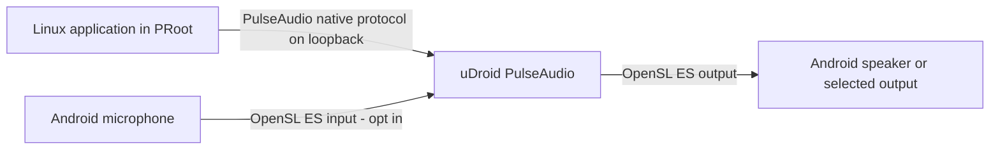

# Audio runtime

uDroid provides Linux playback and optional microphone input through an
app-owned PulseAudio server. PulseAudio talks to Android through its OpenSL ES
sink and source modules; PRoot clients talk to PulseAudio over authenticated
device-local loopback.



The listener is bound only to `127.0.0.1`; it never uses Wi-Fi, mobile data, or
an external network interface. PRoot does not reliably translate
pathname-based Unix socket `connect()` calls, so uDroid uses PulseAudio's
loopback transport and bind-mounts only its private authentication cookie into
supervised guests. Terminal, desktop, and graphical application launches
receive:

```text
PULSE_SERVER=tcp:127.0.0.1:4713
PULSE_COOKIE=/tmp/.udroid-pulse/cookie
```

## Using it

Open an installed Linux system in uDroid and use its **Audio** controls.
Speaker playback is enabled by default. Microphone input is off by default and
requires Android's microphone permission. Android shows its microphone privacy
indicator while capture is active.

Linux applications need a PulseAudio-compatible client library. Many desktop
images already include one. If `pactl` or `paplay` is missing, install your
distribution's PulseAudio client utilities; the server itself remains on the
Android side and does not need to run inside the rootfs.

Useful guest checks:

```sh
printf '%s\n' "$PULSE_SERVER"
pactl info
pactl list short sinks
pactl list short sources
```

## Lifecycle

- Settings are stored per installed rootfs.
- Changing a setting updates a running rootfs without restarting its desktop.
- The audio server stops with the supervised Linux runtime.
- Android service recreation restores playback, but deliberately leaves the
  microphone off until the user returns to uDroid and starts or enables it
  again.
- Resetting or deleting a rootfs clears its saved audio settings.

## Packaged runtime

`tools/build-pulseaudio-assets.sh` reproduces the ABI-specific runtime archives
from checksum-pinned official Termux packages listed in
`tools/pulseaudio-packages.tsv`. Only PulseAudio, the native TCP protocol, the
OpenSL ES sink/source, and their ELF dependency closure are packaged.

This bridge is independent of fake-media-accel. Audio PCM transport and video
codec acceleration have different lifecycles and data paths.
