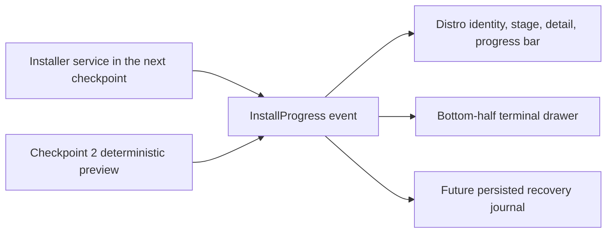

# Checkpoint 2: distro and installation experience

## Outcome

This checkpoint defines how uDroid serves users who want Linux without
terminal ceremony and users who want every technical detail.

The Linux page:

- loads the live uDroid image catalogue;
- selects URLs and hashes for the device ABI;
- recommends Ubuntu 22.04 Jammy raw as the conservative starting point;
- hides the full compatible-image list behind **Show all images**;
- falls back to a cached catalogue and then a built-in Jammy recovery entry.

Selecting an image starts a clearly labelled UX preview. No rootfs archive is
downloaded in this checkpoint.

## Shared operation contract

The normal and technical surfaces do not implement separate installers:

| Audience | Default information |
| --- | --- |
| Normal user | Distro identity, plain-language stage, measured progress, current detail |
| Expert user | Exact command-like events, selected image ID, architecture, hash and paths |
| Both | The normal surface plus **Show terminal**, opening a bottom drawer without leaving the operation |

The same pattern should be reused for boot, repair, package upgrades, exports,
and hardware-profile setup. Friendly copy may summarize an event, but it must
not invent a status that the underlying operation did not report.

## Progress model

The current weights reserve progress according to expected real-world cost:

| Stage | Weight |
| --- | ---: |
| Device and metadata checks | 5% |
| Download | 40% |
| SHA-256 verification | 10% |
| Rootfs extraction | 30% |
| First-boot configuration | 15% |

These weights make the preview honest enough to evaluate visually. The real
installer must derive each stage fraction from bytes, files, or completed
steps instead of timers.

## Catalogue compatibility

The upstream catalogue currently spells the variant array as `varients` and
friendly name as `FirendlyName`. The parser intentionally preserves those
wire keys at the boundary instead of silently requiring corrected data.

Android ABIs map to catalogue architectures as follows:

| Android ABI | uDroid key |
| --- | --- |
| `arm64-v8a` | `aarch64` |
| `armeabi-v7a` | `armhf` |
| `x86_64` | `amd64` |

## Verified in this checkpoint

- The catalogue parser runs in local JVM tests and understands the upstream
  wire format.
- Weighted progress remains monotonic through the preview sequence.
- The debug APK builds for all packaged ABIs.
- The live catalogue and installation drawer are checked on the Pixel 6a.

## Next checkpoint

Replace the deterministic preview with a foreground installer service that:

1. preflights storage against content length plus extraction headroom;
2. downloads to a staging file with HTTP range resume;
3. streams byte progress and transfer speed into the shared event model;
4. verifies the catalogue SHA-256;
5. extracts into a staging rootfs with cancellation and recovery markers;
6. atomically activates the completed distro;
7. survives Activity recreation and exposes the same terminal drawer.
