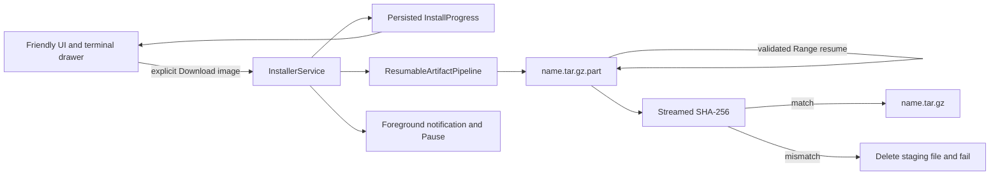

# Checkpoint 3: resumable image core

## Outcome

uDroid now has a real service-owned Linux-image pipeline. The catalogue remains
safe to browse: selecting an image creates a persisted review plan, and no
artifact directory or network transfer exists until the user presses
**Download image**.

This checkpoint ends when the compressed archive is verified and promoted into
the application cache. It deliberately does not extract or activate a rootfs.

## Runtime boundary

The transfer engine has no Android UI dependency. The service converts byte
callbacks into the same `InstallProgress` model consumed by the friendly
surface and terminal drawer.

## Resume and integrity rules

- Partial data is written only to a `.part` path.
- An existing partial file sends `Range: bytes=<length>-`.
- A `206` response must include a valid `Content-Range` beginning at exactly
  the saved length.
- Release-asset redirects are followed explicitly and retain the Range header.
- HTTPS downloads may not redirect to cleartext HTTP.
- If a server ignores Range and returns `200`, the staging file is truncated
  and safely restarted instead of appended.
- A matching `416 bytes */<total>` means the partial file already contains the
  complete body and can proceed to verification.
- The final cache name appears only after the complete file matches the
  catalogue SHA-256.
- A mismatch deletes the staging artifact and never promotes it.
- A previously promoted file is re-hashed before reuse.

## Runtime economics

The transfer loop reads 64 KiB blocks but does not persist every callback:

| Work | Frequency |
| --- | --- |
| Network and file write | Every 64 KiB |
| Persisted/UI progress | At most every 300 ms, plus completion |
| Notification update | At most every 1 second, plus completion |
| Terminal progress line | Approximately each 10% bucket |
| File sync | Before verification |

This keeps progress responsive without turning SharedPreferences, broadcasts,
notifications, or terminal formatting into the transfer bottleneck.

## Pause and recovery

- The foreground notification and in-app screen expose **Pause**.
- Pause interrupts the worker but retains `.part`.
- Persisted state records bytes, total size, current stage, rate, operation ID,
  and a bounded terminal history.
- Resume reuses the same distro request and partial archive.
- The service returns `START_REDELIVER_INTENT` so Android can redeliver an
  interrupted operation after process pressure.
- Activity recreation never owns or cancels the transfer.

## Validation

The dependency-free loopback fixture covers:

1. fresh transfer, verification, and atomic promotion;
2. valid partial resume;
3. safe restart when a server ignores Range;
4. checksum mismatch cleanup;
5. verified cache reuse without network access;
6. Range preservation across a release-asset redirect.

The Pixel 6a device gate verifies:

- selecting an image creates no artifact directory;
- the review state survives force-stop and Activity recreation;
- the real download requires a separate explicit tap;
- the enlarged-font UI exposes both friendly status and terminal details.

A full Jammy rootfs was intentionally not downloaded during this checkpoint.
That avoids consuming gigabytes or disrupting the shared mobile connection
while the transport contract is still being validated with deterministic
fixtures.

## Next checkpoint

Consume the verified archive through a cancellable extraction pipeline:

1. preflight compressed archive plus rootfs expansion headroom;
2. extract into a unique staging directory with PRoot-compatible hard-link
   handling;
3. persist file/byte progress and recovery markers;
4. apply resolver, passwd/group, Android AID, and profile fixes;
5. run a minimal PRoot health command;
6. atomically rename the staging rootfs into the installed catalogue.
