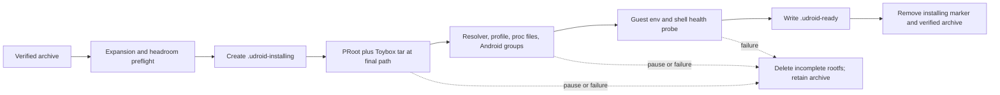
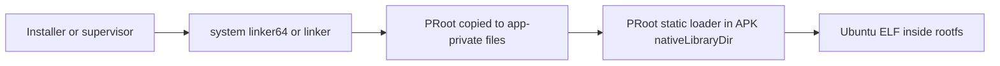

# Checkpoint 4: recoverable rootfs readiness

## Outcome

uDroid now converts a verified distro archive into a bootable PRoot filesystem
without exposing a partial installation as ready.

The same foreground installer that owns download and verification now owns:

1. storage preflight;
2. PRoot extraction into the stable final rootfs path;
3. Android compatibility configuration;
4. an actual command executed inside the guest;
5. a synced ready marker published only after validation.



## Recovery contract

- The stable installed path is used from the first extracted byte so PRoot's
  absolute hard-link translations remain valid.
- `.udroid-installing` records ownership and the operation UUID.
- Only an incomplete path carrying uDroid's installing marker is cleared after
  interruption.
- An existing unmarked destination is preserved and causes a visible failure.
- A rootfs is reusable only when `.udroid-ready` exists.
- Pause or failure removes the incomplete rootfs and retains the verified
  archive, so retry never needs the network.
- The archive is deleted only after the health probe and ready-marker sync
  succeed.

The current pause granularity is the archive stream. Resume restarts extraction
from the already verified archive because safely resuming an arbitrary tar
filesystem mutation is more complex and less reliable than rebuilding the
disposable staging directory.

## Android execution bridge

Android 10 prevents a target-SDK-29-or-newer app from directly executing an ELF
stored in writable app-private data. uDroid targets API 36 and uses two
different locations deliberately:



- The first hop invokes the app-private Android PRoot ELF through
  `/system/bin/linker(64)`.
- PRoot's static loader is packaged as `libproot-loader.so` and extracted by
  Android into the APK native-library directory, which remains executable.
- `PROOT_LOADER` selects that packaged loader, avoiding PRoot's default of
  extracting and directly executing a helper from writable cache.

This follows the system-linker execution technique documented by Termux. It
does not disable Android SELinux and does not require root.

## Extraction and compatibility

The build script pins PRoot `5.1.107.86` and talloc `2.4.3`, verifies both
source archives, applies one local NDK 28 include fix, and emits Android
artifacts for `arm64-v8a`, `armeabi-v7a`, and `x86_64`.

Extraction runs Android Toybox tar inside a PRoot rooted at the staging
directory. That confines absolute archive paths to staging and enables
`--link2symlink` for filesystems where Linux hard links are unsuitable.

The configurator then writes:

- `/etc/hosts` and `/etc/resolv.conf`;
- a small `/etc/profile.d/udroid.sh`;
- compatibility files used for selected `/proc` projections;
- Android supplementary groups for the app process;
- required `/dev`, `/proc`, `/sys`, `/tmp`, and profile directories.

The health gate requires a guest shell, `/usr/bin/env`, and
`/etc/os-release`, then executes the check through PRoot. A host-side file
check alone is not accepted as proof that the distro can execute.

## Runtime economics

The expensive operation is measured at the archive boundary:

| Work | Cost policy |
| --- | --- |
| Archive read and PRoot stdin write | 64 KiB blocks |
| Persisted and UI extraction progress | At most every 300 ms, plus completion |
| Notification progress | At most every second, plus completion |
| Terminal extraction line | Approximately each 10% bucket |
| Rootfs tree scan | None in the progress loop |
| Retry after extraction failure | Reuse verified archive; no network |
| Storage estimate | max of gzip ISIZE and 4x compressed size, plus 256 MiB |

The progress value measures compressed bytes consumed, not a guessed file count.
Large individual archive members can therefore cause brief flat sections even
while decompression and filesystem writes continue.

## Device evidence

The checkpoint was exercised on a Pixel 6a running the API-36 build:

- cached Jammy archive: `180,408,792` bytes;
- archive SHA-256:
  `63f8dbb323570f1bd4c149c774dd05717f611111aa5da3105a32255139f69d26`;
- activated rootfs: `387,739` KiB on the device;
- staging directory absent after completion;
- verified archive absent after completion;
- `.udroid-ready` present;
- foreground installer service stopped itself;
- direct post-install PRoot probe returned GNU coreutils `env 8.32`.

Two failures were retained as explicit regression lessons:

1. PRoot's default cache loader hit SELinux `execute_no_trans`; packaging the
   matching loader in `nativeLibraryDir` fixed the second execution hop.
2. Comparing canonical and absolute paths falsely identified files below
   Android's `/data/user/0` alias as symlinks; the configurator now uses
   `Files.isSymbolicLink`.

## Validation gates

Local tests cover successful activation order, interruption cleanup, ready
rootfs reuse, preservation of unknown destinations, unsafe path rejection, and
creation of Android compatibility files.

Every checkpoint build must continue to pass:

```sh
./gradlew :app:testDebugUnitTest :app:lintDebug :app:assembleDebug
```

## Completed by Checkpoint 5

[Checkpoint 5](CHECKPOINT_5_INTERACTIVE_TERMINAL.md) now consumes the
ready rootfs through an explicit bind contract, supervises PRoot as the
owned terminal child, attaches Termux's PTY and terminal surface, and provides
graceful stop plus stale-session recovery. Graphical sessions and hardware
profiles remain optional future layers.
