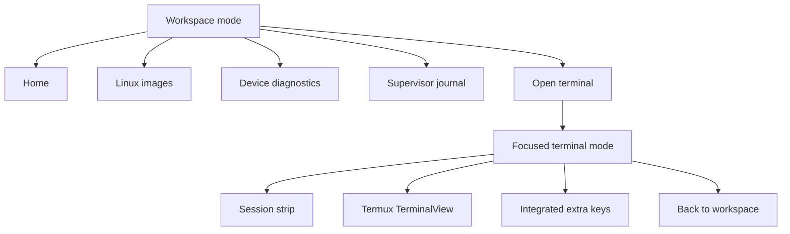

# Checkpoint 5.1: adaptive workspace and focused terminal

Checkpoint 5.1 replaces the generic card-dashboard treatment with a two-mode
application architecture inspired by the current Termius Android redesign.
The change is structural rather than a color imitation:

- management is a light, dense, list-driven workspace;
- an active terminal becomes a dedicated dark work surface;
- global navigation does not compete with the terminal;
- compact screens use four primary destinations with real vector icons;
- wide screens replace the bottom bar with a navigation rail;
- Device diagnostics remain available from Workspace without occupying a
  fifth compact-screen destination.

The earlier generated concept image was rejected and was not used as a source
or added to the repository.

## Interaction architecture

The terminal still uses the service-owned `TerminalSession` and real PTY from
Checkpoint 5. Only the view hierarchy and color contract changed. The
emulator's background, foreground, cursor, and primary ANSI accents now match
the surrounding terminal workspace, so the Android view no longer looks
embedded in a different product.

## Design contract

### Management mode

- neutral `#F2F4F3` canvas and white operational surfaces;
- 11–14 dp radii rather than large promotional cards;
- 48 dp minimum control targets;
- sans-serif interface labels and monospace only for machine data;
- explicit status badges instead of relying on color alone;
- four compact destinations: Home, Linux, Terminal, and Logs;
- all five destinations in the wide navigation rail;
- content capped at 900 dp on wide screens.

### Terminal mode

- `#11131F` terminal canvas with matching system bars;
- one compact session tab containing system, user, architecture, and PID;
- no bottom application navigation while terminal input is active;
- 48 dp Ctrl, Alt, escape, tab, cursor, paging, and boundary keys;
- Android Back and the visible back action both return to Workspace without
  stopping the supervised session;
- the stop action remains explicit and visually separated from navigation.

## Upstream guidance used

The implementation follows Android's guidance to use bottom navigation for
three to five primary compact-screen destinations, change navigation form on
larger windows, respect safe drawing insets, and keep interactive targets at
least 48 dp:

- <https://developer.android.com/design/ui/mobile/guides/layout-and-content/layout-and-nav-patterns>
- <https://developer.android.com/develop/ui/compose/build-adaptive-apps>
- <https://developer.android.com/design/ui/mobile/guides/foundations/accessibility>
- <https://developer.android.com/design/ui/mobile/guides/layout-and-content/edge-to-edge>

The product-mode split follows Termius's public Android redesign: bottom tabs
on phones, top-level adaptation on larger devices, and a focused terminal
workspace with session controls:

- <https://termius.com/blog/termius-for-android-a-final-milestone-in-termius-redesign>
- <https://play.google.com/store/apps/details?id=com.server.auditor.ssh.client>

## Pixel 6a evidence

Validated against the existing Jammy installation on the connected Pixel 6a:

| Probe | Result |
| --- | --- |
| Debug APK upgrade | Existing app data and Jammy rootfs preserved |
| Compact navigation | Four visible vector-icon destinations |
| Terminal focus mode | Global navigation removed; safe insets retained |
| PTY input | `pwd` returned `/root` |
| Session continuity | Same service-owned PID while moving between modes |
| Portrait | Terminal and management layouts render without clipping |
| Landscape | Terminal expands horizontally; management switches to rail |
| Font scale 1.30 | Navigation labels remain single-line and unobscured |
| System bars | Light in management, dark in terminal |

The checkpoint does not add multiple concurrent sessions, terminal tab
creation, SSH hosts, or desktop/X11 controls. The session strip is deliberately
ready for those future capabilities without pretending they exist today.
