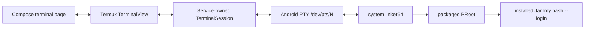

# Checkpoint 5: supervised interactive terminal

Checkpoint 5 replaces the one-shot runtime probe with a real interactive
Jammy shell. It deliberately reuses Termux's mature terminal emulator and PTY
bridge while keeping uDroid responsible for product UI, installation, PRoot
launch policy, supervision, and recovery.

## Runtime boundary

`RuntimeSupervisorService` is the single session owner. The Activity binds and
attaches a view, but it never owns or recreates the child process. Leaving the
Activity detaches only the view; returning attaches a new view to the same
session and transcript. Android process recreation with persisted
`desiredRunning=true` asks the foreground service to recover the session while
the Activity is visible.

## Launch contract

The native PTY bridge calls `execvp()` with a complete argument vector. uDroid
therefore makes `/system/bin/linker64` both the executable and `argv[0]`,
followed by the packaged PRoot binary. The PRoot invocation:

- selects only an atomically activated rootfs containing `.udroid-ready`;
- binds Android `/system`, `/apex`, `/dev`, `/proc`, `/sys`, and the linker
  configuration into the guest;
- passes the packaged static guest loader through `PROOT_LOADER`;
- starts `/bin/bash --login` when available, with `/bin/sh` as the fallback;
- uses a clean guest environment with explicit home, shell, locale, terminal,
  and path values.

Pure unit tests lock down this argument and environment contract so accidental
argument reordering is detected without repeatedly launching a full distro.

## Runtime economics

Terminal output does not travel through Compose state or the persisted
journal. Termux uses one 4 KiB process-to-terminal queue and one 4 KiB
terminal-to-process queue; screen callbacks invalidate the Android view
directly. This keeps every shell byte out of serialization, broadcasts, and
Compose recomposition.

The transcript is intentionally bounded to 8,000 rows. Only lifecycle events
and failure summaries enter uDroid's structured journal. This split gives
normal users a responsive screen while retaining a familiar scrollback and
extra-key row for advanced users.

## Device evidence

Validated on the connected Pixel 6a running Android 16:

| Probe | Result |
| --- | --- |
| Login | `root@localhost:~#` |
| PTY | `/dev/pts/1` |
| Guest architecture | `aarch64` |
| Guest directory | `/root` |
| Portrait size | `37 44` |
| Landscape size | `8 101` with the IME hidden |
| Signal input | `sleep 30` interrupted by the UI `CTRL` key plus `c` |
| Activity reattach | Same PRoot PID and transcript after Home/reopen |
| Stop | PRoot process exited and persisted state became `STOPPED` |

The terminal library loaded from the APK without a crash. Its arm64
`libtermux.so` `LOAD` segments report `0x4000` alignment, satisfying the 16 KiB
page-size build requirement. The app shell also consumes safe-drawing insets,
so API 36 edge-to-edge enforcement no longer overlaps the status or gesture
bars.

## Scope and next gate

This checkpoint provides one supervised terminal session. It does not yet
provide tabs, multiple distros running concurrently, background job controls
in the product UI, an X11 server, desktop lifecycle, or GPU integration.

The next checkpoint should introduce stable session identities and a
terminal/session list before the desktop layer depends on the lifecycle
contract.
