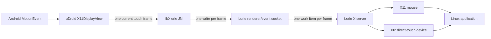
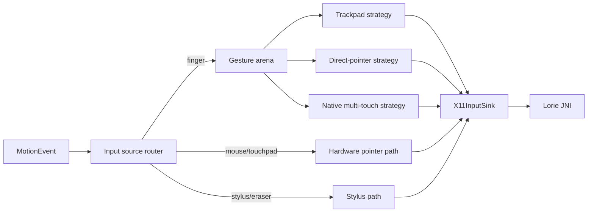
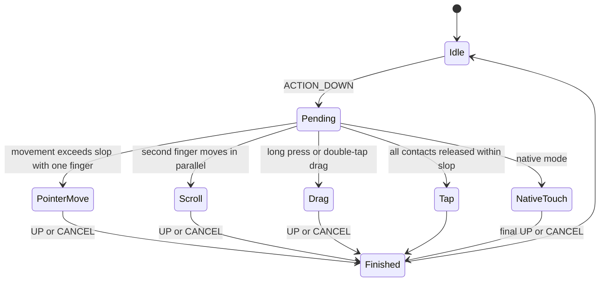

# Desktop input and session roadmap

Status: native multi-touch transport checkpoint implemented, 2026-07-26

This document records the planned touchscreen input contract and the deferred
desktop-session, display-ownership, and multi-display work. It is not a promise
that every gesture or session topology will be enabled in the first
implementation.

## Goals

- Make touch interaction predictable for both desktop-shaped and touch-aware
  Linux applications.
- Preserve real Android multi-pointer events when the guest supports them.
- Never leave a guest mouse button, modifier, or touch contact stuck.
- Keep the Android display frontend independent from the Linux desktop
  lifecycle.
- Measure input cost with deterministic probes before repeatedly testing a
  complete desktop environment.

## Current input path



The native server already provides:

- an X11 mouse;
- an XI2 direct-touch device;
- `XI_TouchBegin`, `XI_TouchUpdate`, and `XI_TouchEnd` transport;
- up to 20 guest touch contacts;
- separate pen and eraser device support upstream.

The current uDroid view exposes three user modes:

- `DIRECT` immediately positions the mouse and holds the left button for the
  complete finger-down interval;
- `TRACKPAD` converts one-finger movement to relative mouse movement and a
  short tap to a left click;
- `NATIVE` maps sparse Android pointer IDs onto 20 bounded guest slots and
  emits XI2 Begin/Update/End events for every contact.

`DIRECT` remains a mouse-oriented mode and does not mean native guest touch.

Upstream Termux:X11 contains useful reference implementations for:

- one-, two-, and three-finger tap detection;
- trackpad and simulated-direct pointer strategies;
- two-finger scrolling;
- swipe-versus-pinch arbitration;
- conversion of Android pointers to XI2 touch events.

The complete upstream `TouchInputHandler` is tied to its `MainActivity`,
preferences, notifications, Samsung DeX helpers, and global renderer state.
uDroid should reuse small independent pieces or port their tested behavior into
an app-owned controller instead of restoring the upstream Activity lifecycle.

Lorie is an upstream base, not a fixed platform boundary. uDroid may patch its
Java, JNI, renderer, event transport, and X11 input code when a cleaner contract
requires it. Patches remain small, auditable, reproducible from the pinned
upstream revision, and covered by release checks.

## Input architecture



The Android side should be split into:

1. `X11InputSink`
   - the small interface that emits mouse, wheel, key, touch, and later stylus
     events;
   - production implementation calls Lorie JNI;
   - recording implementation supports deterministic unit and instrumentation
     tests.
2. `X11CoordinateMapper`
   - maps surface coordinates through the active letterboxed viewport;
   - returns primitive coordinates without allocating objects for every move.
3. `X11GestureController`
   - owns exactly one gesture stream from `ACTION_DOWN` through `ACTION_UP` or
     `ACTION_CANCEL`;
   - chooses one strategy for the stream and prevents duplicate mouse and touch
     delivery.
4. `X11InputState`
   - tracks pressed mouse buttons and active guest touch slots;
   - can release all state during cancellation, renderer detach, focus loss,
     mode changes, and surface destruction.

### Planned Lorie-native contract

The current JNI layer stores the display view, renderer connection, EGL window,
viewport, and filtering state in process-global variables. This must not define
uDroid's long-term architecture.

The target API gives each display frontend an explicit native context:

```text
nativeCreateRenderer() → renderer handle
nativeAttachConnection(handle, fd)
nativeSetSurface(handle, Surface?)
nativeSetViewport(handle, ...)
nativeSendInput(handle, ...)
nativeReleaseAllInput(handle)
nativeDestroyRenderer(handle)
```

Each `X11DisplayView` owns one handle. Native code validates the handle and
stores the Java global reference, event connection, EGL objects, surface,
viewport, filtering, and pressed-input state in that context. This removes
`globalThiz` and the single-renderer connection as architectural assumptions.

The first measured implementation showed that replaying every Android
historical sample and sending every contact through a separate JNI call,
socket write, and X-server work item creates catch-up latency. The current
native path therefore uses a fixed primitive frame buffer and sends all
contacts in one JNI call, one socket write, and one X-server work item per
Android `MotionEvent`.

The current private frame contains ordered XI2 action, guest slot, x, and y
tuples. Begin and End are never discarded. A later versioned contract should
also contain:

- action and Android event time;
- active contact IDs and coordinates;
- tool type and optional pressure;
- an explicit cancel-all operation.

The renderer/event socket is private to the APK, so its wire structure may be
versioned alongside the Java bridge. A capability/version handshake is
preferred over silently assuming that both sides understand a newly extended
event structure.

## User-facing input modes

### Trackpad

Designed for traditional desktop interfaces with small pointer targets.

| Gesture | Guest event |
| --- | --- |
| One-finger move | Relative pointer movement |
| One-finger tap | Left click |
| One-finger double-tap and move | Left-button drag |
| One-finger long-press and move | Left-button drag |
| Two-finger tap | Right click |
| Two-finger parallel move | Horizontal or vertical wheel scroll |
| Three-finger tap | Middle click |
| Pinch | No action initially |
| Three-finger swipe | No action initially |

The cursor must stop moving as soon as a second finger claims a scroll or
multi-finger tap. Adding a second finger must never leave a pending left button
pressed.

### Direct pointer

Designed for desktop controls that are large enough to touch directly while
remaining mouse-driven.

| Gesture | Guest event |
| --- | --- |
| One-finger tap | Move pointer to contact and left click |
| One-finger long-press and move | Move pointer and left-button drag |
| Two-finger tap | Move pointer to first contact and right click |
| Two-finger parallel move | Wheel scroll at the first-contact position |
| Three-finger tap | Middle click |
| Pinch | No action initially |

A normal contact must not send mouse-down immediately. It remains a possible
tap until movement or the long-press threshold commits the stream to dragging.
This prevents a second finger from turning an ordinary two-finger gesture into
an accidental left drag.

### Native multi-touch

Designed for Linux applications that consume XI2 touch events.

| Android event | Guest event |
| --- | --- |
| `ACTION_DOWN` | `XI_TouchBegin` |
| `ACTION_POINTER_DOWN` | another `XI_TouchBegin` |
| `ACTION_MOVE` | `XI_TouchUpdate` for every active contact |
| `ACTION_POINTER_UP` | final update and `XI_TouchEnd` for that contact |
| `ACTION_UP` | final update and `XI_TouchEnd` |
| `ACTION_CANCEL` | `XI_TouchEnd` for every active contact |

Native mode must not also synthesize mouse gestures. The X server or
application decides whether touch should emulate pointer behavior.

Android pointer IDs are sparse and can be reused. They must not be used as
array indexes. The controller should maintain:

```text
Android pointer ID → guest slot 0..19
```

A slot is allocated on pointer-down and released only after its matching
touch-end. If all 20 slots are occupied, additional contacts are ignored and
counted in diagnostics rather than corrupting an existing stream.

The initial 20-contact limit comes from Lorie's current XInput device
initialization. It may be raised or made configurable in the native device
definition if real hardware and guest tests justify it.

## Gesture arbitration



Rules:

- A stream is delivered to only one strategy.
- Android `ViewConfiguration` supplies touch-slop, tap, double-tap, and
  long-press thresholds.
- Finger count is the maximum simultaneous contact count observed during a tap,
  not merely the count present at final `ACTION_UP`.
- Two-finger swipe and pinch remain undecided until both fingers move beyond
  touch-slop.
- A pinch is not converted to `Ctrl` plus wheel until it has an explicit,
  tested setting. Native mode forwards the two contacts unchanged.
- Coordinates outside a letterboxed desktop cannot begin direct-pointer or
  native-touch actions. Trackpad-relative movement may use the complete
  surface.

## Cancellation contract

`releaseAllInput()` must be called when any of these occur:

- `ACTION_CANCEL`;
- renderer detach or replacement;
- Android window focus loss;
- surface destruction;
- input-mode change during a gesture;
- display switch;
- desktop/session stop;
- input device removal while a button is held.

It must:

1. release every synthesized mouse button;
2. emit `XI_TouchEnd` for every allocated guest touch slot;
3. clear pending tap, double-tap, drag, and scroll state;
4. clear delayed gesture callbacks;
5. allow the next `ACTION_DOWN` to begin from a clean state.

The cleanup operation must be idempotent.

## External input routing

Input source classification happens before finger gesture arbitration:

| Android source/tool | Route |
| --- | --- |
| `SOURCE_MOUSE` and `TOOL_TYPE_MOUSE` | absolute mouse/button path |
| `SOURCE_MOUSE_RELATIVE` | captured relative-pointer path |
| `SOURCE_TOUCHPAD` | hardware touchpad path |
| `TOOL_TYPE_FINGER` on touchscreen | selected touchscreen mode |
| `TOOL_TYPE_STYLUS` | stylus path |
| `TOOL_TYPE_ERASER` | eraser path |

Bluetooth keyboard-touchpad devices sometimes report `SOURCE_MOUSE` with
`TOOL_TYPE_FINGER`. The source router needs a tested compatibility rule for
these devices before pointer capture is enabled.

Stylus pressure, tilt, orientation, hover, barrel buttons, and eraser behavior
are a later checkpoint. The Lorie native protocol already has most of the
transport, but uDroid's JNI registration and display frontend do not yet expose
the complete upstream stylus contract.

## Performance and observability

The first checkpoint is tooling, not a complete desktop test.

Per input mode, record:

- incoming `MotionEvent` count and pointer count;
- emitted mouse, wheel, touch-begin, touch-update, and touch-end counts;
- handler CPU time with p50, p95, and maximum duration;
- allocations observed on move-heavy traces;
- coalesced or discarded move samples;
- rejected contacts after the 20-contact limit;
- forced cleanup and stuck-state prevention events.

Move handling should avoid per-event object allocation. Trackpad and
direct-pointer modes need only the newest position. Native touch initially
emits the current position of every active pointer in one transport frame.
Historical Android samples are intentionally not replayed: they are stale when
the callback runs and previously created visible event-queue pressure.

Diagnostics must be aggregated. Production logs must not print every move
event.

### 2026-07-26 touch transport measurement

The controlled probe used the same three-second synthetic Android swipe before
and after current-position coalescing:

| Process | Baseline CPU ticks | Coalesced CPU ticks |
| --- | ---: | ---: |
| uDroid app | 152 | 136 |
| Lorie X11, during input | 135 | 133 |
| Touchscope | 16 | 15 |
| Lorie X11, three-second post-input drain | 17 | 9 |

The adb swipe does not include Android historical batches or simultaneous
contacts, so the table is a single-contact correctness and queue-tail check,
not the final multi-touch performance result. It shows a shorter X11 drain but
cannot quantify the main multi-contact reduction.

The subsequent framed-transport build passes all host unit tests and native
builds for arm64, armv7, and x86_64. On the Pixel device, a fresh Touchscope
run received one Begin, 180 Updates, and one End with zero sequence errors.
`Max batch 2` confirms that the final update and End crossed JNI, the socket,
and the X-server work queue as one frame. A physical simultaneous-finger trace
remains necessary because adb cannot synthesize it.

## Deterministic test ladder

### Host-side state-machine tests

Feed synthetic pointer traces into a recording `X11InputSink`:

1. one-finger tap;
2. move beyond touch-slop;
3. long-press drag;
4. double-tap drag;
5. two-finger tap;
6. two-finger scroll;
7. swipe-versus-pinch transition;
8. three-finger tap;
9. pointer IDs greater than 10 and sparse pointer IDs;
10. cancel during every state;
11. renderer detach during drag and native touch;
12. rotation or viewport change during a stream.

Every trace asserts the exact ordered guest event sequence and finishes with no
pressed buttons or active contacts.

### Android instrumentation

Use `MotionEvent.obtain` with multi-pointer properties and coordinates against
the real display view and a recording sink. Cover portrait, landscape, native,
scaled, fixed-resolution, stretched, and letterboxed viewports.

### Tiny guest probe

Build a small XInput2 client that records:

- pointer motion and buttons;
- smooth or wheel scrolling;
- `XI_TouchBegin`, `XI_TouchUpdate`, and `XI_TouchEnd`;
- device names and capabilities;
- event ordering and contact IDs.

This is the primary guest-side probe. It starts quickly and avoids repeatedly
booting Plasma, XFCE, or a browser while the event contract is still changing.

`tools/touchscope` now implements this probe as a standalone XI 2.2
visualizer. It draws up to 20 numbered contacts, reports event rate and source
device capabilities, detects unbalanced Begin/Update/End sequences, and ships a
freedesktop launcher entry. Strict macOS, Linux x86_64, and Linux ARM64 builds
pass; its sequence-recovery self-test and a headless XI 2.2 window smoke test
also pass. The ARM64 probe is installed in the Jammy guest and the app discovers
its launcher. Native mode passes on-device single-contact sequences with
balanced Begin/Update/End counts and zero sequence errors. Touchscope now
selects the concrete XI2 touch source rather than double-counting the same
event through both slave and master selection. Physical multi-contact testing
remains the next device check.

### Real-session smoke

Only after deterministic probes pass:

1. XFCE or another lightweight X11 session;
2. Plasma X11;
3. GTK and Qt scrolling, context menus, selection, drag-and-drop, and native
   touch test applications;
4. ten-minute cancellation and surface-detach soak.

## Implementation checkpoints

1. **Input sink and trace harness**
   - extract the JNI calls behind `X11InputSink`;
   - implement the recording sink and synthetic trace format;
   - add cancellation invariants.
   - Current progress: a primitive-only, stateful sink now fronts Lorie input,
     host tests record exact event order, and view lifecycle cancellation
     releases tracked mouse buttons and touch contacts idempotently.
2. **Trackpad gestures**
   - one-finger cursor and tap;
   - two-finger right-click and scrolling;
   - long-press/double-tap drag;
   - three-finger middle-click.
   - Current progress: implemented as a bounded primitive state machine with
     no move-path allocations. Exact host traces cover pointer movement,
     one-, two-, and three-finger taps, parallel scrolling, pinch rejection,
     both drag paths, sparse Android pointer IDs, and idempotent cancellation.
3. **Direct-pointer gestures**
   - delayed tap commitment;
   - direct positioning, drag, context click, and scrolling;
   - correct letterbox rejection.
4. **Native multi-touch**
   - 20-slot pointer-ID allocator;
   - full begin/update/end/cancel mapping;
   - explicit native cancel-all support;
   - measure individual versus batched JNI/event transport;
   - tiny XI2 guest probe.
   - Current progress: Native is exposed in settings. A fixed-array controller
     maps sparse/reused Android IDs onto stable guest slots, forwards batched
     current contact state without hot-path allocation, recovers missing Down
     events, and releases contacts on cancellation and lifecycle transitions.
     Lorie now accepts a complete ordered touch frame through one JNI call,
     socket write, and X-server work item. Deterministic host traces, clean
     patch-stack reconstruction, and the on-device Touchscope single-contact
     probe pass.
5. **Settings and user education**
   - expose Trackpad, Direct pointer, and Native touch;
   - keep advanced gestures disabled unless implemented;
   - show a short gesture reference per selected mode.
6. **External touchpad and stylus**
   - pointer capture and rotation transforms;
   - pen, eraser, pressure, tilt, hover, and buttons.
7. **Instance-based Lorie renderer**
   - move Java references, event connections, EGL state, surfaces, viewport,
     and filtering into a native renderer context;
   - give every `X11DisplayView` its own native handle;
   - validate detach, reattach, two-context, and context-destruction tests;
   - retain the stable single-context path until artifact and performance gates
     pass.

## Deferred desktop-session work

The following design is intentionally deferred until the input contract is
stable.

### X11 session discovery

Discover sessions from each rootfs using display-manager entries such as:

```text
/usr/local/share/xsessions/*.desktop
/usr/share/xsessions/*.desktop
```

Parse `Name`, `Icon`, `Exec`, `TryExec`, `DesktopNames`, `Hidden`, and
`NoDisplay`. Keep separate states for detected, runnable, and previously
started successfully.

### Desktop lifecycle

The foreground runtime supervisor will own:

```text
STOPPED → STARTING → RUNNING → STOPPING
                 ↘ FAILED ↗
```

The Activity remains a detachable viewer. Desktop process groups, session
D-Bus, graceful stop, forced cleanup, recovery, and logs belong to the
supervisor.

### Display ownership

Lorie is the server owner. One rootfs/session holds the desktop lease for each
display:

```text
Display :0
├── server owner: uDroid
└── desktop lease: Ubuntu Jammy / Plasma X11 / boot generation
```

Lease acquisition is atomic. Starting a different distro on an occupied
display requires an explicit stop-and-switch action. Recovery validates the
host process, process-start token, X socket, window-manager property, and boot
generation before accepting a persisted lease.

### Multiple displays

Use independent X servers, not multiple X screens:

```text
:0 → Ubuntu / Plasma X11
:1 → Debian / XFCE
:2 → free
```

The initial server pool may run one X server per Android process. This provides
fault isolation and fits Xorg's process-wide server model, but it is a deliberate
design choice rather than a declaration that Lorie cannot be changed.

The renderer frontend should be refactored to the instance-based native context
described above. After that, uDroid can choose between:

- keeping several desktops alive and attaching one Android surface at a time;
- retaining one renderer context per display for faster switching;
- showing two displays simultaneously on sufficiently capable devices.

The first user-facing implementation should default to at most two running
displays. Simultaneous presentation remains capability- and performance-gated,
not prohibited by the architecture.

Normal UI may call these Linux workspaces. Advanced UI may expose display
numbers, PIDs, sockets, leases, and renderer state.
