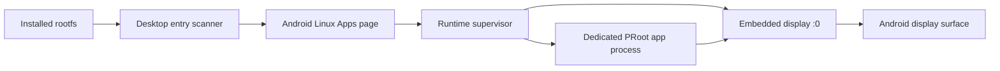
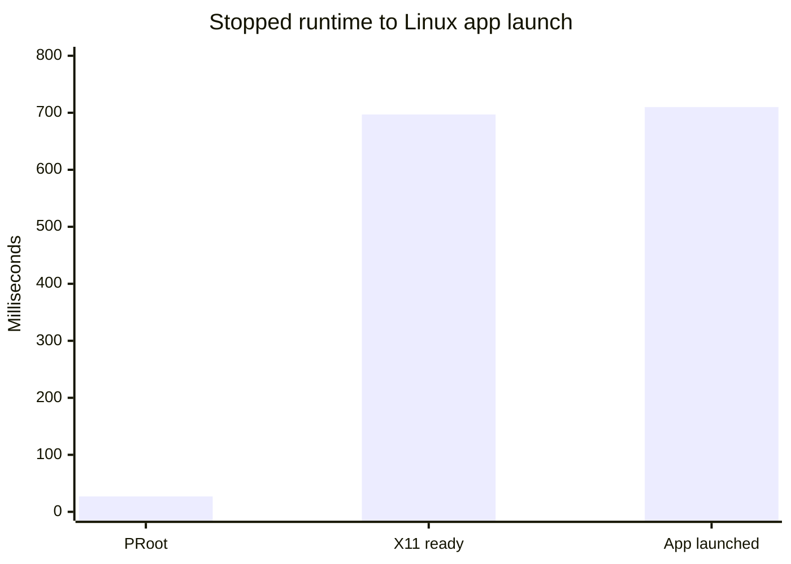

# Linux application launcher

Status: first working checkpoint, 2026-07-24

## Product contract

uDroid treats freedesktop `.desktop` files in the installed distro as its Linux
application registry. The Android Apps page shows the entries that are valid
and launchable in the active rootfs. Selecting a graphical application starts
Linux and embedded X11 when required, launches a separate supervised PRoot
process, and attaches the Android display.

The scan reads the rootfs directly from app-private Android storage instead of
starting PRoot. This produces the same desktop-entry view with less CPU,
latency, and failure surface. Guest-absolute symbolic links are resolved
against the rootfs rather than Android's `/`, preserving PRoot filesystem
semantics for `TryExec`.

## Discovery and parsing

The current search order is:

1. `/root/.local/share/applications`
2. `/usr/local/share/applications`
3. `/usr/share/applications`
4. `/var/lib/flatpak/exports/share/applications`

Higher-precedence desktop IDs mask lower entries, including `Hidden=true`
overrides. The scanner supports localized names, comments, `Type=Application`,
`Hidden`, `NoDisplay`, `TryExec`, `OnlyShowIn`, `NotShowIn`, `Terminal`,
`Path`, `Categories`, and icon names.

`Exec` is tokenized into an argument vector. uDroid does not concatenate a
graphical command into `sh -c`. Supported field codes are expanded according
to the freedesktop contract; file/URL codes are removed until Android document
handoff exists, and malformed or unknown field codes reject the entry.

The implementation follows the
[Desktop Entry Specification](https://specifications.freedesktop.org/desktop-entry/latest/)
and uses the
[Icon Theme Specification](https://specifications.freedesktop.org/icon-theme/latest/)
for its initial PNG/icon lookup.

## Launch ownership

Graphical applications receive an isolated environment containing:

- `DISPLAY=:0`
- `XDG_CURRENT_DESKTOP=UDROID`
- `GDK_BACKEND=x11`
- `QT_QPA_PLATFORM=xcb`
- the same private X11 socket bind used by the interactive distro

Each application is a separate PRoot process owned by
`RuntimeSupervisorService`. Output is drained off the process pipe into the
structured journal, exit status is recorded, replacement launches terminate a
previous process with the same desktop ID, and stopping Linux terminates all
owned app processes.

`Terminal=true` entries are safely shell-quoted and opened in the supervised
interactive terminal. A later multi-session terminal checkpoint should give
each terminal application its own PTY instead of sharing the main shell.

## Pixel 6a evidence

The deterministic fixture
[`tools/fixtures/xclock.desktop`](../tools/fixtures/xclock.desktop) was
installed as a user desktop entry in the Jammy rootfs. The scanner found it in
12–54 ms and suppressed the image's stale `vim.desktop` because its
`TryExec=vim` executable was absent.

The complete stopped-runtime launch measured:

| Event | Time from tap |
| --- | ---: |
| Terminal process running | 27 ms |
| X11 protocol ready | 697 ms |
| XClock process launched | 710 ms |

XClock rendered successfully on the embedded Android surface. The structured
journal recorded `terminal_start_requested`, `session_started`,
`server_ready`, `app_launched`, application output, and process exit.

## Next boundaries

- Render SVG and XPM icons instead of using category fallbacks.
- Maintain a persistent D-Bus session and honor `DBusActivatable=true`.
- Pass Android documents and URLs into `%f/%F/%u/%U`.
- Add per-app logs and running-state controls.
- Let users pin selected Linux applications to the Android launcher. Android
  limits ordinary dynamic shortcuts, so the catalog remains in uDroid and
  home-screen integration should use user-requested pinned shortcuts:
  [Android shortcut guidance](https://developer.android.com/develop/ui/compose/system/shortcuts).
