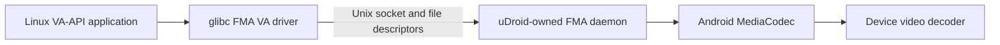
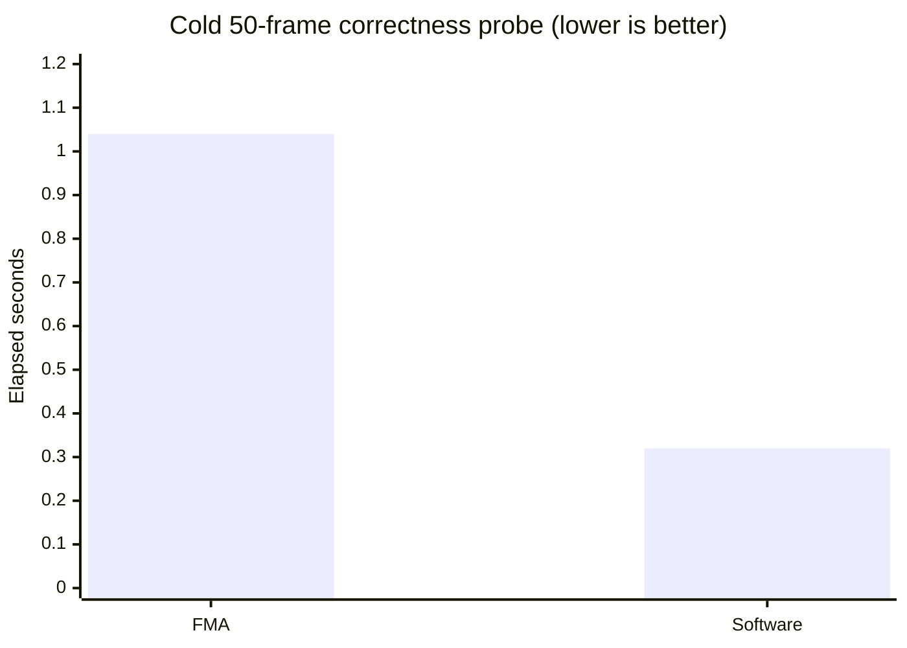

# Media acceleration runtime

uDroid can expose Android's MediaCodec decoders to compatible glibc Linux
systems through the VA-API bridge from
[fake-media-accel](https://github.com/RandomCoderOrg/fake-media-accel). This is
a codec bridge, not a GPU driver, and does not depend on Panfork, Mali, Turnip,
or any particular display implementation.



## Lifecycle

Media acceleration is an experimental per-system setting and is off by
default. When enabled, the runtime supervisor starts one app-owned daemon
before the Linux terminal and stops it with that terminal. Terminal, desktop,
and direct application launches all receive the same endpoint. Enabling or
disabling the setting takes effect after the Linux system is restarted. A
daemon failure is recorded in the supervisor journal but does not prevent Linux
from starting.

The daemon receives a parent-death signal from the Android runtime and writes
an app-private PID marker. This prevents native daemon processes accumulating
after an app crash or upgrade; the next supervisor start also validates and
removes a stale marker before replacing the socket.

The host transport directory is mounted at `/tmp/.udroid-media`. When the
socket is ready, uDroid exports:

```text
FMA_SOCKET=/tmp/.udroid-media/fake-media-accel.sock
FMA_VA_SYNC_DIRECT_OUTPUT=1
LIBVA_DRIVERS_PATH=/tmp/.udroid-media
LIBVA_DRIVER_NAME=fma
```

The direct-output guard waits for Android's `FRAME_READY` reply before visible
VP9/AV1 DMA-heap surfaces are exposed to applications. The raw DMA-heap file
descriptor does not carry MediaCodec's release fence by itself.

The VA driver is glibc-linked, so uDroid deliberately does not export it to
musl systems such as Alpine. MediaCodec and DMA-heap support are probed at
runtime. If a mappable DMA heap is unavailable to the app, FMA retains its
CPU-mappable surface fallback.

## Packaged source

`tools/build-fma-assets.sh` reproduces the Android daemon and matching guest
driver for `arm64-v8a`, `armeabi-v7a`, and `x86_64` from FMA commit
`1da72812c411b67f76d8c20a093cb0ff54760251`. CI runs
`tools/verify-fma-assets.sh` to reject missing, mismatched, or graphics-stack-
linked binaries.

H.264 has exact-frame validation in FMA, including the project's full Gravity
trailer fixture. Some H.264 POC type 1 streams currently require FMA's
vendor-gated FFmpeg adapter to preserve the original packet metadata. VP9,
AV1, frame presentation, and broad application compatibility remain separate
validation gates and must not be inferred from the runtime merely starting.

The current working-tree arm64 asset is a local conformance build rather than
the pinned release artifact. It is intentionally not publishable until the FMA
changes are committed and the build script reproduces matching arm64, armv7
and x86_64 assets.

## Local browser lifecycle checkpoint

A signed local APK extracted its own daemon and driver, started the media
runtime through `RuntimeSupervisorService`, and exported the bridge to Ubuntu.
Chrome then decoded H.264, VP9 and AV1 consecutively in one process:

| Codec | Expected/decoded | Drops | Result |
| --- | ---: | ---: | --- |
| H.264 High | 96/96 | 1 | passed |
| VP9 Profile 0 | 96/96 | 1 | passed |
| AV1 Main | 96/96 | 0 | passed |

The terminal command contained the app-private socket mount and direct-output
guard. A force-stop/reopen lifecycle probe left no orphan daemon and recovered
one new PID marker and socket. These are local integration results, not release
support claims.

The same signed build then ran continuous 40-second Gravity streams with the
desktop visible and canvas sampling disabled. The presentation callback itself
recorded timing without copying pixels:

| Codec | Decoded | Drops | Backward callbacks | Gaps over 100 ms | Worst gap |
| --- | ---: | ---: | ---: | ---: | ---: |
| H.264 High | 960 | 0 | 0 | 0 | 83.6 ms |
| VP9 Profile 0 | 960 | 6 | 0 | 2 | 116.8 ms |
| AV1 Main | 960 | 5 | 0 | 0 | 83.5 ms |

One VP9 gap was decoder startup. Its only steady-state gap over 100 ms was
100.1 ms at 29.1 seconds and did not skip or reverse a presented frame. A
synchronized 24-second Android screen recording also advanced from the green
rating card through the opening title sequence without returning to an earlier
card.

## App-domain H.264 checkpoint

The probe build was installed beside the release app on a Pixel 6a. The real
uDroid supervisor started the Android daemon in the app SELinux domain, mounted
its private transport into an Ubuntu glibc rootfs, and ran the pinned FMA VA
driver through patched FFmpeg. A 50-frame segment of the Gravity H.264 fixture
matched software-decoder plane checksums for every frame.

| Measurement | FMA hardware path | Software path |
| --- | ---: | ---: |
| Decoded frames | 50 | 50 |
| Exact plane-checksum matches | 50 | 50 |
| Cold elapsed time | 1.04 s | 0.32 s |
| FMA direct surfaces | 50/50 | n/a |
| VA-driver surface-store copy | 0 MiB | n/a |



This is a correctness and integration result, not a throughput win. The cold
FMA run spent about 560 ms creating the MediaCodec context, downloaded 126.6
MiB through `vaGetImage`, and spent about 52.6 ms copying MediaCodec output
into the shared pool. The driver avoided its second surface-store copy and the
Unix transport sent no frame payload bytes. Longer playback and direct display
import are the next performance gates; neither should be inferred from this
short readback-heavy probe.
