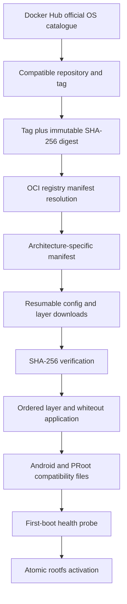

# OCI images

uDroid can install official operating-system container images as ordinary
PRoot root filesystems. This path does not run Docker, containerd, a privileged
daemon, namespaces, or a nested container runtime. The app implements the
small OCI distribution and layer-processing surface needed to produce a
verified rootfs in app-private storage.

The first release of this path deliberately limits discovery to active
operating-system images in Docker Hub's official `library` namespace. A
repository appearing in search is not enough to start a download: the user
must select a tag that has a compatible image for the phone architecture and
review its size and source first.

## Installation path



The UI stores both the human-facing tag and its platform digest. Installation
therefore resolves a reference such as:

```text
docker.io/library/almalinux:latest@sha256:<digest>
```

The tag remains useful to the user, while the digest prevents a mutable tag
from silently selecting different content between review and installation.

## Discovery and caching

Repository discovery accepts only entries that:

- belong to Docker Hub's official `library` namespace;
- are active image repositories in the operating-systems category;
- use a validated repository name;
- are not described as deprecated.

Tag discovery filters the returned platform descriptors against Android's
supported ABI. `arm64-v8a`, for example, maps to OCI `linux/arm64/v8`.
Repository metadata is cached for six hours and tag metadata for two hours.
When refresh fails, an existing validated cache can be shown as stale data
instead of removing the catalogue. Activity recreation also retains the
selected repository and reloads its tag state.

The catalogue is intentionally not a general Docker Hub search. Community
images, arbitrary registries, private credentials, and user-provided image
references need a separate trust and UX design.

## Registry and download boundaries

The registry client supports OCI and Docker v2 image indexes and manifests. It
selects the requested OS, architecture, and variant, limits metadata response
sizes, and verifies manifest digests supplied by both the selected descriptor
and the registry response.

Anonymous Bearer challenges are supported over HTTPS. The returned token is
used only for requests to the original blob origin. The shared resumable
artifact pipeline rejects unsafe header names and values, controls Range
requests itself, and does not forward authorization headers across a
cross-origin redirect.

Each config or filesystem blob is written to a partial file, resumed when
possible, checked against its descriptor's SHA-256 digest, and atomically
promoted to the verified blob cache. Interrupted verified data can be reused
by a later attempt. Verified blobs are removed after a rootfs is activated.

## Layers, whiteouts, and activation

OCI filesystem layers are applied in manifest order. Before extracting a
layer, uDroid scans its tar entry names and applies:

- `.wh.<name>` as deletion of the lower-layer path;
- `.wh..wh..opq` as removal of lower-layer children in that directory.

Whiteout marker files are excluded from normal tar extraction. Every planned
path is confined to the staging rootfs, so a malformed layer cannot use
whiteouts to delete app data outside that directory.

Tar entry-name scanning supports ustar prefixes, POSIX PAX paths, GNU long
names, checksum validation, octal sizes, and positive base-256 sizes. PAX
records may also contain binary extended attributes. The scanner decodes the
record key first and decodes a value as UTF-8 only when the key is `path`.
This matters for AlmaLinux, whose official layer contains binary
`SCHILY.xattr.security.capability` data that is valid tar metadata but is not
UTF-8 text.

Extraction occurs in an operation-owned staging directory. On success uDroid:

1. writes Android DNS, identity, mount, and PRoot compatibility files;
2. executes the same mounted first-boot health probe used by archive installs;
3. writes the ready marker;
4. atomically renames staging storage to the final installation name.

Failed staging data is removed only when its ownership marker matches the
current OCI installation. An unrelated or unrecognized directory is left
untouched.

## State and progress

Archive and OCI installations share one persisted `InstallerWorkRequest`
contract and the same foreground installer service. The state snapshot records
the immutable image reference, target platform, installation name, operation
identifier, progress stage, byte totals, terminal transcript, and whether the
operation can be cancelled.

Older archive-only snapshots are migrated when read. OCI progress survives
Activity recreation and process interruption, and the UI reattaches to the
same saved operation rather than creating another installation implicitly.

## Validation

The implementation has unit coverage for:

- image-reference parsing and normalization;
- manifest-list platform selection and digest verification;
- Bearer authentication and origin-confined request headers;
- resumable aggregate progress;
- Docker Hub catalogue and tag parsing, caching, and stale fallback;
- whiteout planning and path confinement;
- tar checksums, PAX paths, GNU long names, and binary PAX attributes;
- transactional activation, failure cleanup, persisted progress, and legacy
  state migration.

Android probe tests use the separate
`org.randomcoder.udroid.ociprobe` application ID so destructive rootfs tests
cannot uninstall or overwrite the normal uDroid package. The real-device
checkpoint installed the official arm64 AlmaLinux `latest` layer end to end,
including compatibility configuration and the first-boot health probe.

## Current limitations

- Discovery is restricted to anonymous official Docker Hub operating-system
  images.
- Only OCI/Docker image indexes, manifests, gzip tar layers, and uncompressed
  tar layers are accepted.
- Signatures, attestations, SBOM policy, private registries, and registry
  credentials are not implemented.
- A container image is a minimal rootfs, not a complete machine boot. Services
  that require a real kernel, systemd/logind, privileged mounts, or namespaces
  still need PRoot-specific handling.
- An official image can still contain userspace assumptions that do not work
  under Android. Digest verification proves content identity, while the
  first-boot probe establishes only the baseline execution contract.
