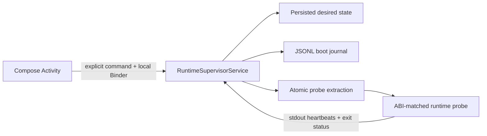

# Phase 1: Android shell and supervisor

## Purpose

Prove that Android owns the runtime lifecycle before importing the existing
uDroid core, PRoot, Xorg, or any optional hardware profile.

## Current state contract

- The Activity is recreatable and does not own the child process.
- The service promotes itself before doing process work and returns
  `START_STICKY`.
- `desiredRunning` is persisted before a launch or stop transition.
- Every start receives a UUID boot ID.
- The child requests `SIGTERM` when its Android parent dies.
- An unexpected child exit becomes `Crashed`; it is recorded rather than
  hidden by an infinite restart loop.
- Stop targets the exact `Process` instance owned by the active generation.
- The journal is capped by rotating the previous file after 1 MiB.

## Next slice

Checkpoint 2 imports the distro-catalogue boundary and defines the shared
friendly-progress/terminal event contract. The next runtime slice replaces the
UX preview with a resumable download, SHA-256 verification, atomic extraction,
and recovery journal owned by a foreground installer service.

The maintained Lorie surface follows as an optional graphical session backend;
shell-only distributions remain valid uDroid configurations.
