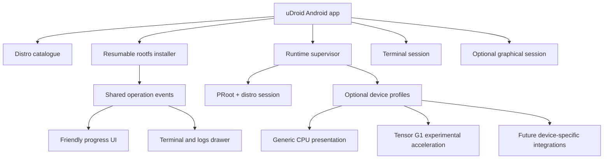

# uDroid Android product scope

## Product

uDroid is a general Android application for installing, booting, stopping,
repairing, and interacting with Linux distributions through PRoot. It replaces
a terminal-first workflow with an Android-first lifecycle and UI.

## One operation, two levels of detail

Every long-running operation is designed for both ordinary and expert users:

- The default surface answers what is happening, how far it has progressed,
  and whether the user needs to act.
- **Show terminal** opens a bottom drawer with the exact technical event
  stream and eventually an interactive PTY when an operation supports one.
- The friendly view and terminal are projections of one service-owned state
  machine. They must never run separate commands or disagree about status.

This progressive-disclosure pattern applies to installation, boot, repair,
package updates, exports, and optional hardware-profile setup.

The main journey is:

1. Open uDroid.
2. Choose a compatible Linux distribution and session type.
3. Download and install it with resumable, real progress.
4. Tap **Boot**.
5. Use its shell or graphical desktop.
6. Stop, repair, update, export files, or inspect diagnostics from the app.

## Platform layers

## Non-goals for the core app

- Requiring a Tensor phone, Mali GPU, `/dev/mali0`, or patched Mesa.
- Pretending every distribution has or needs a full desktop.
- Making GNOME, KDE, Firefox, games, or hardware video the basic health gate.
- Requiring Termux or Termux:X11 as separately installed applications.
- Treating SSH or ADB as a product control plane.

## Relationship to existing repositories

- `RandomCoderOrg/fs-manager-udroid` is the behavior and distro-management
  source. Its typed Go manifest, rootfs, and PRoot packages are candidates for
  reuse behind a stable Android bridge.
- `tensor-g1-proot-gpu` is an optional experimental hardware profile and a
  source of graphics/media artifacts. It does not define the product.
- Termux and Termux:X11 remain important upstream code sources for PTY,
  terminal, input, and X11 behavior, but the final uDroid app owns its own UID,
  paths, lifecycle, and user experience.
