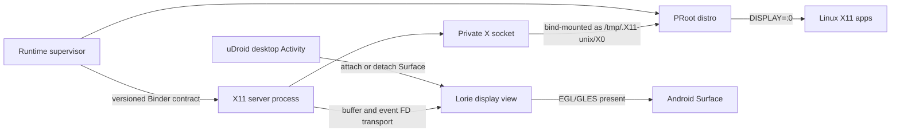

# Embedded X11 runtime architecture

Status: accepted integration boundary, 2026-07-24

## Decision

uDroid will embed the Termux:X11 `lorie` library and native X server in the
uDroid APK. It will not require the separate Termux:X11 application, launch an
X server through `app_process`, or use broadcasts as its internal control
plane.

The first generic graphics backend is the unmodified Android GLES presenter.
Device-specific acceleration, including the Tensor G1 Panfrost profile, is an
optional layer above the same X11 session contract.

The initial upstream baseline is Termux:X11 commit
`0cb0203c283bfafbad380b90444296aa42af058d`. This revision split the project
into a reusable `:lorie` library and a thin `:lorie-app` wrapper. uDroid will
track the upstream source and carry a small, auditable integration patch set.

Embedding GPLv3 Termux:X11 code changes the distribution obligations of the
combined APK. The source import checkpoint must update the root license and
third-party notices before a binary containing that code is published.

## Runtime ownership

- `RuntimeSupervisorService` owns desired state, startup order, shutdown,
  recovery, logs, and health.
- The X server runs in an app-private Android process. It may outlive the
  desktop Activity and its `Surface`.
- The desktop Activity owns only the visible Android surface and input/IME
  adapters. Closing or rotating it must not terminate Linux or the X server.
- The X socket and control socket live in a per-generation private runtime
  directory. That directory is bind-mounted into PRoot as `/tmp`.
- The control protocol uses Binder and file descriptors. It is never exposed
  on TCP and never accepts an unauthenticated broadcast.

## Upstream pieces

Keep:

- Xorg/Xwayland-independent Lorie X server core
- `LorieBuffer`, DRI3, Present, EXA, RandR, XKB, clipboard, and input protocol
- Android EGL/GLES renderer
- `LorieView` surface, IME, clipboard, and pointer behavior
- pinned Xorg, Pixman, XKB, and transport dependencies

Replace or adapt:

- `CmdEntryPoint` shell-side loader
- hidden framework APIs and package lookup
- the retrying localhost/broadcast connection handshake
- Termux package paths and assumptions
- upstream Activity/navigation/preferences ownership
- process lifetime inferred from Activity lifetime

## Surface contract

The Android side follows four rules:

1. A surface can appear, resize, disappear, and reappear without restarting
   the X server.
2. Buffer stride and format come from the allocator; width is never assumed to
   equal stride.
3. A buffer is not reused until its release fence or equivalent completion
   signal is observed.
4. The stable generic path is retained whenever a zero-copy or
   device-specific path fails capability or artifact probes.

The cursor should eventually use an independent Android surface. That keeps
pointer movement from damaging or presenting the complete desktop.

## Deterministic gates

Desktop environments are not the first health test. Each gate records latency,
RSS/PSS, CPU time, frame/present counts, and failure reason.

1. `server-start`: the native process reaches the Xorg ready state.
2. `socket-ready`: the private `X0` socket exists and accepts a connection.
3. `x-query`: a tiny client reads the root window geometry and required
   extensions.
4. `test-pattern`: the server draws a deterministic pattern with a known
   checksum and the Android surface receives frames.
5. `surface-cycle`: attach, resize, detach, and reattach without restarting
   the server.
6. `input-loop`: injected pointer and key events are observed by a tiny X
   client.
7. `present-soak`: bounded frame pacing and buffer lifetime test.
8. `xterm`: first real guest application.
9. `lightweight-session`: first desktop, initially without composition.

GNOME, KDE, browsers, and games remain later macro probes.

## AOSP TerminalApp assessment

The AOSP Virtualization `TerminalApp` is a useful reference, but not a usable
backend for uDroid's non-root PRoot product:

- It runs a Debian guest through Android Virtualization Framework and crosvm,
  not PRoot.
- Its GUI sends an Android `Surface` to crosvm's display service and forwards
  input through `VirtualMachine` APIs.
- VirGL and gfxstream accelerate `virtio-gpu` commands from a VM guest. PRoot
  applications do not speak that protocol.
- The app is built with platform APIs, is privileged, and requests
  `MANAGE_VIRTUAL_MACHINE` and `USE_CUSTOM_VIRTUAL_MACHINE`. A normal uDroid
  release cannot depend on those capabilities.

The reusable design lessons are surface attach/detach independent of VM
lifetime, direct Android-surface presentation, allocator stride correctness,
a separate cursor surface, explicit display/input configuration, and
last-frame preservation while the UI is backgrounded.

Sources inspected:

- [AOSP TerminalApp](https://android.googlesource.com/platform/packages/modules/Virtualization/+/refs/heads/main/android/TerminalApp/)
- [AOSP custom VM graphics notes](https://android.googlesource.com/platform/packages/modules/Virtualization/+/HEAD/docs/custom_vm.md)
- [crosvm Android display backend](https://android.googlesource.com/platform/external/crosvm/+/refs/heads/main/gpu_display/src/gpu_display_android.rs)
- [Termux:X11](https://github.com/termux/termux-x11)
