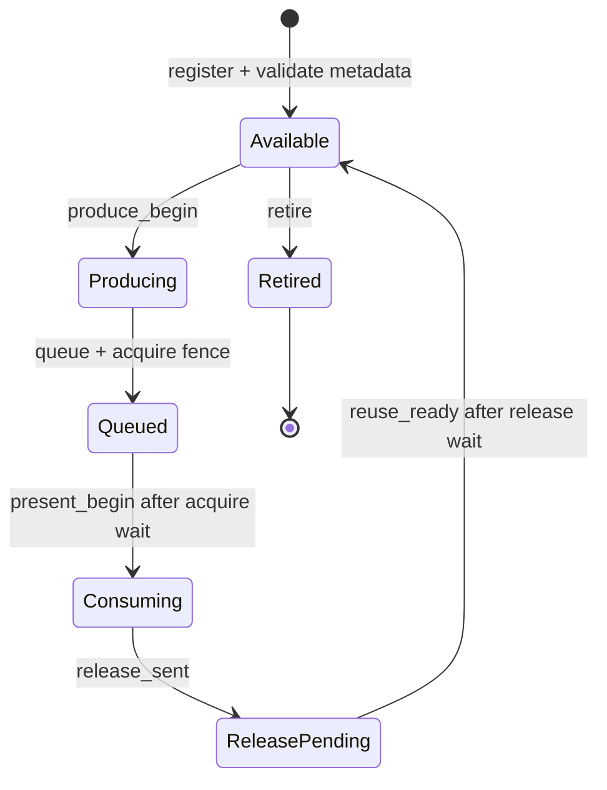

# gfxstream winsys contract

Status: required architecture gate; the gfxstream desktop profile remains
experimental.

## Decision

Vendor Vulkan and gfxstream remain the rendering path. A raw DMA-BUF or an
AHardwareBuffer handle is not, by itself, a display protocol. uDroid will not
promote another X11 WSI artifact fix until one owner validates the complete
resource lifecycle described here.

The previous desktop experiments distributed ownership between Mesa WSI,
Kumquat, Termux:X11 and the Android Surface. That allowed allocation and import
to succeed while layout, synchronization, reuse or device selection disagreed.
The recurring result was recognizable but corrupted output, followed by a
mixed session where KWin and Plasma selected different rendering paths.

The last protocol-v1 recovery point is the committed runtime pair:

- host runtime `5-0d9d623-1f2939dc0`;
- guest runtime `7-fb349a2d3b5`.

The later host-10/guest-8 modifier experiment is preserved in the original
dirty worktree. It is evidence, not a new baseline: its X11 root capture was
already corrupted before Termux:X11 reached the Android Surface.

Protocol-v2 development uses reproducible source checkpoints instead of that
dirty worktree:

- uDroid presenter `e4271e2`;
- Kumquat lifecycle, trace and DMA-BUF import endpoint `9194909`;
- gfxstream imported-resource source `36967251d`;
- Mesa guest resource-import transport `234edeb74d`;
- packaged host runtime `8-9194909-36967251d`.

This pair is a test candidate, not a promoted desktop runtime. The internal
producer and the first external gfxstream swapchain passed the v2 lifecycle;
the independently timestamped producer/presenter merge still has to clear the
gate below.

## Production reference

AOSP Terminal uses a real virtio-gpu device and configures both
`gfxstream-vulkan` and `gfxstream-composer`. crosvm keeps resource identity,
allocator metadata, fences and display import in its virtio-gpu resource
manager. Android BufferQueue similarly owns slots and acquire/release fences
around `GraphicBuffer` objects.

uDroid cannot copy the privileged VM transport into a rootless PRoot process,
but it must preserve the same contracts:

1. one stable resource identity and generation;
2. allocator-authoritative width, height, format, planes, offsets, strides and
   modifier or an explicit AHardwareBuffer-native layout;
3. monotonic frame identity;
4. producer completion before presentation;
5. consumer release before resource reuse;
6. safe retirement on resize, surface replacement and process loss;
7. one truthful graphics device contract for Vulkan, EGL, GLX and compositor
   clients;
8. a controlled copy fallback when import cannot be proven correct.

## Resource state machine



Every event is keyed by `(resource, generation)`. A new generation never
revives an older in-flight resource. Every frame-bearing event carries the same
positive, monotonically increasing frame number from `produce_begin` through
`reuse_ready`.

Registration must fail closed when:

- dimensions, layer count, format or usage are invalid;
- stride is smaller than logical width;
- DMA-BUF plane layout is incomplete;
- an AHardwareBuffer description changes after socket transport;
- the same resource/generation is registered twice;
- an older generation is still in flight.

## Trace schema

The opt-in probe emits one JSON object per state transition after the marker
`UDROID_WINSYS`. Schema version 1 uses these common fields:

```json
{"schema":1,"event":"produce_begin","resource":1,"generation":1,"frame":42}
```

`register` additionally carries `surface_generation`, `width`, `height`,
`layers`, `format`, `usage` and `stride`. The validator is
`tools/graphics/winsys_trace_validator.py`; it accepts raw JSONL or Android
logcat lines containing the marker.

## Promotion order

KDE is not a validation probe. Gates must pass in this order:

1. deterministic AHardwareBuffer producer/presenter lifecycle;
2. multi-resource rotation and at least 1,000 reuse cycles;
3. resize, Surface detach/reattach and stale-generation rejection;
4. gfxstream resource flush with matching producer and presenter traces;
5. standalone Vulkan and Zink clients;
6. standalone QtQuick and X Composite workloads;
7. Weston with Xwayland as the first complete compositor boundary;
8. Plasma only after every process reports the same accelerated device.

Any visual corruption, contract violation, split renderer selection or
unattributed full-frame copy returns the profile to the preceding gate. The
Standard graphics profile remains the product fallback throughout.

Run the first trace gate with:

```sh
adb logcat -c
adb shell am start -n \
  org.randomcoder.udroid.dev/org.randomcoder.udroid.gfxstream.GfxstreamPresenterProbeActivity \
  --ez contractTrace true --ei resourceCycleFrames 120
# Let the deterministic probe run, then close it with Android Back.
adb logcat -d -s uDroid-Winsys:I | \
  python3 tools/graphics/winsys_trace_validator.py
```

## Measured checkpoint

Pixel 6a (`bluejay`, Mali-G78), 2026-08-29, dev APK built from this branch:

| Probe | Frames | Resources | In flight at shutdown | Result |
| --- | ---: | ---: | ---: | --- |
| steady AHardwareBuffer reuse | 2,246 | 1 | 0 | pass |
| replace buffer every 120 frames | 968 | 9 | 0 | pass |

Both captures remained visually intact at approximately 60 FPS with zero
reported swap or fence failures. The validator observed the complete lifecycle
for every accepted frame. This clears promotion gates 1 and 2 for the internal
deterministic producer only; it does not yet qualify gfxstream, X11, Weston or a
desktop compositor.

The same build also passed three Android Home/foreground detach cycles (643
frames across four retired resources) and a live `1080x2400 -> 720x1600 ->
1080x2400` replacement (550 frames across three retired resources). Each resize
used the allocator-reported stride: 1088, 720, then 1088. The validator rejects
synthetic stale generations, premature reuse and retirement while in flight;
an end-to-end stale-packet injection remains part of the external-producer
gate.

A short pacing audit recorded frame 1 at `11:36:14.502` and frame 409 at
`11:36:21.308`, or 60.09 accepted frames per second on the physical 60 Hz
display. Use `tools/graphics/run_winsys_contract_probe.sh` for subsequent
`steady`, `cycle`, `reattach`, and `resize` captures so timing and lifecycle
results come from the same log.

## External producer gate

The existing private AHardwareBuffer protocol version 1 is not promotable to a
desktop winsys. Its audit found four structural gaps:

1. packets identify a resource and generation but not a frame, so an acquire or
   release fence cannot be attributed to one exact submission;
2. the Android presenter retains only one external EGLImage, while a Vulkan
   swapchain and a desktop compositor keep multiple resources live;
3. Kumquat retains registrations until process exit and has no explicit retire
   message;
4. Android Surface detach destroys the current import without telling Kumquat,
   which continues to treat that resource as registered.

Protocol version 2 must therefore be a coordinated host/app change, not a
compatibility shim. It must add a positive monotonic frame id to every
frame-bearing packet and explicit `reuse_ready` and `retire` messages. The
Android side must own a registry keyed by `(resource, generation)` and retain
each imported AHardwareBuffer independently of the current Surface. Surface
loss pauses presentation; it does not silently retire producer resources.

The v2 implementation now exists on both endpoints. Kumquat assigns a frame id
per registered resource, waits for the matching release before announcing
reuse, and retires the resource on final context detach. The Android presenter
keeps a multi-resource registry across Surface replacement and rejects early
reuse, stale frames, stale generations, and retirement while a release is
pending. The opt-in contract mode also records a producer-side monotonic trace
in `no_backup/graphics/kumquat.log`; normal desktop launches leave this tracing
disabled.

Validate the two independent captures with:

```sh
python3 tools/graphics/winsys_dual_trace_validator.py \
  kumquat-producer.log android-presenter.log
```

The external gate passes only when a merged monotonic-clock trace proves all of
the following:

- at least three resources remain registered and rotate for 1,000 frames;
- every acquire and release carries the same frame id end to end;
- no resource is reused until its release is acknowledged;
- explicit retire removes exactly one generation;
- Surface detach/reattach preserves the registry and resumes without a fresh
  registration;
- stale frame, generation, reuse, and retire packets are rejected by both
  endpoints.

### External measured checkpoint

Pixel 6a (`bluejay`, Mali-G78), 2026-08-29, runtime
`7-5605f4c-36967251d` and guest `7-fb349a2d3b5`:

| Probe | Frames | Resources | Producer/presenter mismatches | Result |
| --- | ---: | ---: | ---: | --- |
| rotating external Vulkan images | 1,200 | 3 | 0 | pass |
| Surface detach/reattach while rendering | 600 | 3 | 0 | pass |

The first capture correlated 3,606 independent Kumquat events with 6,006
Android presenter events. Registration, queue, release, reuse and retire tuples
matched exactly. The second capture moved the Activity through Android Settings
and back. The Surface advanced from generation 1 to generation 3, while the
same three external resources continued without re-registration and retired
cleanly after frame 600.

The minimal Debian image needed its declared XCB runtime dependencies before
the current guest ICD could load. Shipping must either bundle those libraries
with the guest runtime or split the direct presenter ICD from X11 WSI so the
headless contract probe does not inherit unrelated X dependencies.

The guest import transport is now rebuilt from the clean Mesa checkpoint
`234edeb74d` and packaged as guest runtime `8-234edeb74d`. Imported images no
longer infer a tightly packed stride after their Vulkan `pNext` chain is gone:
explicit modifier plane layouts are retained at image creation, linear images
query their actual subresource layout, and opaque layouts fail closed. This
runtime is paired with host runtime `8-9194909-36967251d`, whose typed protocol
endpoint validates the DMA-BUF layout, imports it through Rutabaga, attaches it
to the requesting gfxstream context and returns a cloned handle to the guest.
The pair still requires a cross-process export/import test before it replaces
the guest used in the measured presenter results above.

This clears the normal, multi-resource and Surface-replacement portions of the
external gate. Malformed/stale packet injection remains before promotion. The
next gate is a two-process Vulkan DMA-BUF transfer with a deterministic content
hash, followed by an ordinary Vulkan WSI client and Zink. Plasma is still
intentionally out of scope.
