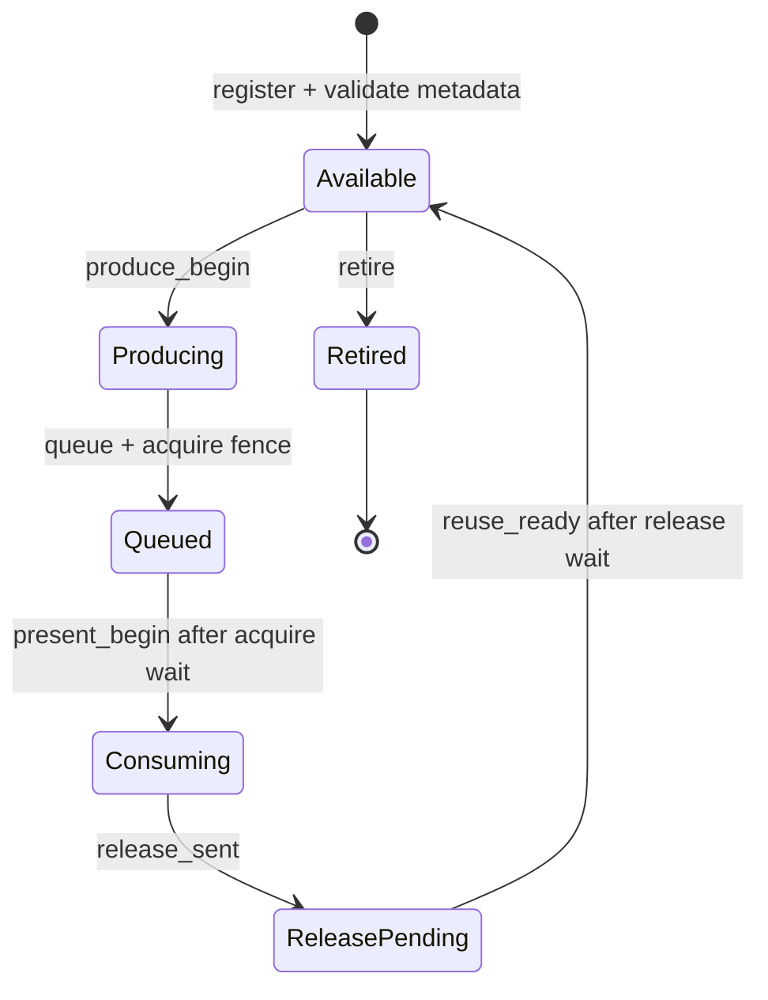

# gfxstream winsys contract

Status: required architecture gate; the gfxstream desktop profile remains
experimental.

## Decision

Vendor Vulkan and gfxstream remain the rendering path. A raw DMA-BUF or an
AHardwareBuffer handle is not, by itself, a display protocol. uDroid will not
promote another X11 WSI artifact fix until one owner validates the complete
resource lifecycle described here.

The previous desktop experiments distributed ownership between Mesa WSI,
Kumquat, Termux:X11 and the Android Surface. That allowed allocation and import
to succeed while layout, synchronization, reuse or device selection disagreed.
The recurring result was recognizable but corrupted output, followed by a
mixed session where KWin and Plasma selected different rendering paths.

The clean recovery point is the committed runtime pair:

- host runtime `5-0d9d623-1f2939dc0`;
- guest runtime `7-fb349a2d3b5`.

The later host-10/guest-8 modifier experiment is preserved in the original
dirty worktree. It is evidence, not a new baseline: its X11 root capture was
already corrupted before Termux:X11 reached the Android Surface.

## Production reference

AOSP Terminal uses a real virtio-gpu device and configures both
`gfxstream-vulkan` and `gfxstream-composer`. crosvm keeps resource identity,
allocator metadata, fences and display import in its virtio-gpu resource
manager. Android BufferQueue similarly owns slots and acquire/release fences
around `GraphicBuffer` objects.

uDroid cannot copy the privileged VM transport into a rootless PRoot process,
but it must preserve the same contracts:

1. one stable resource identity and generation;
2. allocator-authoritative width, height, format, planes, offsets, strides and
   modifier or an explicit AHardwareBuffer-native layout;
3. monotonic frame identity;
4. producer completion before presentation;
5. consumer release before resource reuse;
6. safe retirement on resize, surface replacement and process loss;
7. one truthful graphics device contract for Vulkan, EGL, GLX and compositor
   clients;
8. a controlled copy fallback when import cannot be proven correct.

## Resource state machine



Every event is keyed by `(resource, generation)`. A new generation never
revives an older in-flight resource. Every frame-bearing event carries the same
positive, monotonically increasing frame number from `produce_begin` through
`reuse_ready`.

Registration must fail closed when:

- dimensions, layer count, format or usage are invalid;
- stride is smaller than logical width;
- DMA-BUF plane layout is incomplete;
- an AHardwareBuffer description changes after socket transport;
- the same resource/generation is registered twice;
- an older generation is still in flight.

## Trace schema

The opt-in probe emits one JSON object per state transition after the marker
`UDROID_WINSYS`. Schema version 1 uses these common fields:

```json
{"schema":1,"event":"produce_begin","resource":1,"generation":1,"frame":42}
```

`register` additionally carries `surface_generation`, `width`, `height`,
`layers`, `format`, `usage` and `stride`. The validator is
`tools/graphics/winsys_trace_validator.py`; it accepts raw JSONL or Android
logcat lines containing the marker.

## Promotion order

KDE is not a validation probe. Gates must pass in this order:

1. deterministic AHardwareBuffer producer/presenter lifecycle;
2. multi-resource rotation and at least 1,000 reuse cycles;
3. resize, Surface detach/reattach and stale-generation rejection;
4. gfxstream resource flush with matching producer and presenter traces;
5. standalone Vulkan and Zink clients;
6. standalone QtQuick and X Composite workloads;
7. Weston with Xwayland as the first complete compositor boundary;
8. Plasma only after every process reports the same accelerated device.

Any visual corruption, contract violation, split renderer selection or
unattributed full-frame copy returns the profile to the preceding gate. The
Standard graphics profile remains the product fallback throughout.

Run the first trace gate with:

```sh
adb logcat -c
adb shell am start -n \
  org.randomcoder.udroid.dev/org.randomcoder.udroid.gfxstream.GfxstreamPresenterProbeActivity \
  --ez contractTrace true --ei resourceCycleFrames 120
# Let the deterministic probe run, then close it with Android Back.
adb logcat -d -s uDroid-Winsys:I | \
  python3 tools/graphics/winsys_trace_validator.py
```

## Measured checkpoint

Pixel 6a (`bluejay`, Mali-G78), 2026-08-29, dev APK built from this branch:

| Probe | Frames | Resources | In flight at shutdown | Result |
| --- | ---: | ---: | ---: | --- |
| steady AHardwareBuffer reuse | 2,246 | 1 | 0 | pass |
| replace buffer every 120 frames | 968 | 9 | 0 | pass |

Both captures remained visually intact at approximately 60 FPS with zero
reported swap or fence failures. The validator observed the complete lifecycle
for every accepted frame. This clears promotion gates 1 and 2 for the internal
deterministic producer only; it does not yet qualify gfxstream, X11, Weston or a
desktop compositor.
