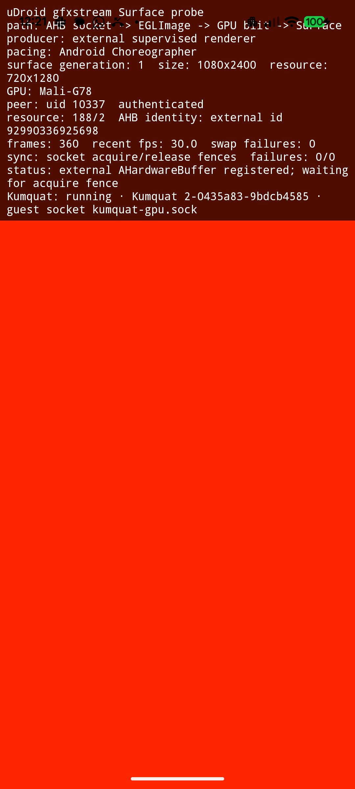

# gfxstream Android Surface presenter

Status: experimental, dev-build probe only.

This checkpoint proves the public Android presentation boundary needed by the
optional gfxstream graphics profile:

```text
AHardwareBuffer -> Unix socket -> EGLImage -> GLES GPU blit -> SurfaceFlinger
```

The existing Termux:X11 desktop remains the default and is not changed by this
experiment. `AhbSurfacePresenterView` is reusable production code, while
`GfxstreamPresenterProbeActivity` exists only in the `dev` source set.

The probe renders a deterministic checkerboard and moving scan line into an
AHardwareBuffer from an independent producer EGL context. It registers the
buffer through Android's public `AHardwareBuffer_sendHandleToUnixSocket` API;
the presenter receives a separate reference, imports it as an EGLImage, and
samples it into an app-owned Surface. Every frame crosses explicit Android
native acquire and release fence file descriptors via `SCM_RIGHTS`. The
producer does not reuse the AHB until the returned release fence has been
consumed. Its overlay reports the actual GL renderer, recent frame rate,
Surface generation, current buffer geometry, swap failures, fence failures,
and transport failures.

The local protocol is defined in `app/src/main/cpp/ahb_transport_protocol.h`.
The presenter binds a `0600` `SOCK_SEQPACKET` listener below the app's private
no-backup directory and accepts only a peer whose `SO_PEERCRED` uid matches the
uDroid app uid. The current deterministic producer connects from the same
process; the listener boundary is ready for a separately supervised renderer
running under that uid.
A registration packet is followed by Android's public AHB handle message.
Acquire and release packets each carry exactly one sync-file descriptor. Every
packet includes a resource id and generation so stale resize or lifecycle
traffic can be rejected. On Android 12 and newer, the probe also compares the
system-wide AHardwareBuffer id on both sides of the socket and rejects an
identity mismatch. The ancillary-data parser closes excess descriptors and
rejects truncated or malformed fence messages.

The presenter now also has a dormant external-producer mode. It waits for a
same-UID supervised process without blocking Activity teardown, imports the
producer's public AHardwareBuffer handle, waits on one matching acquire sync FD
per frame, and returns a release sync FD before that resource may be reused.
The mode is available only through the dev probe's `externalProducer` intent
extra; normal uDroid graphics and the default deterministic probe remain
unchanged. A transport connection or a registered AHardwareBuffer alone is not
counted as a rendered gfxstream frame.

## Run the probe

```sh
./gradlew :app:assembleDev
adb install -r app/build/outputs/apk/dev/app-dev.apk
adb shell am start -n \
  org.randomcoder.udroid.dev/org.randomcoder.udroid.gfxstream.GfxstreamPresenterProbeActivity
```

The separately supervised Android-host Kumquat path remains opt-in and can be
started only from the development Activity:

```sh
adb shell am start -n \
  org.randomcoder.udroid.dev/org.randomcoder.udroid.gfxstream.GfxstreamPresenterProbeActivity \
  --ez externalProducer true
```

## Pixel 6a checkpoint

The Android 17 Pixel 6a probe passed:

- AHardwareBuffer allocation and EGLImage import;
- public Unix-socket AHB registration and sync-file transport;
- GPU rendering into and sampling from the same AHB;
- app background and Surface recreation;
- live display-size replacement from 1080x2400 to 720x1280 and back;
- 20 repeated Surface detach/reattach cycles with five geometry replacements;
- three repeated APK replacement installs and cold launches;
- more than 12,000 presented frames at 59.8-60.1 FPS with zero transport or
  native-fence failures.

The original moving scan line advanced roughly 3.2 physical pixels per 60 Hz
refresh and the renderer paced itself with a free-running 16.667 ms sleep while
EGL also used swap interval one. A later three-run sample exposed the phase
drift: p95 reached 19.9-20.8 ms and 4-11 of 62 intervals exceeded 20 ms.

The probe now takes frame timestamps from Android `Choreographer`, coalesces a
late callback to the newest pending frame, and moves the scan line by less than
one pixel per refresh. Three post-change samples averaged 16.698-16.719 ms,
p95 was 17.864-18.111 ms, the maximum was 19.238 ms, and no interval exceeded
20 ms. This pacing belongs to the Android presenter; it does not claim that a
genuine gfxstream guest frame has reached the Surface.

One pre-stress run produced a persistent black source image while EGL swaps and
fence counters continued normally. A cold process restart recovered it. The
failure did not recur across the lifecycle, geometry, or reinstall matrix above,
so this checkpoint records it as an unresolved visual-correctness observation
rather than claiming that clean transport counters alone prove correct pixels.

## Forked renderer checkpoint

The external work is isolated in organization forks:

- `RandomCoderOrg/rutabaga_gfx`, branch `feat/kumquat-resource-flush`, defines
  a collision-free resource-flush command, parses its damage rectangle, waits
  for an explicit no-data response, and forwards the resource to gfxstream's
  existing `stream_renderer_flush()` path.
- `RandomCoderOrg/gfxstream`, branch `feat/android-ahb-socket-export`, exposes
  an Android-only unstable function that sends an AHardwareBuffer-backed
  renderer resource with `AHardwareBuffer_sendHandleToUnixSocket`. It does not
  inspect the private native handle or reconstruct allocation metadata.

The uDroid development APK now packages a stripped ARM64 Android Kumquat host
and its matching NDK C++ runtime. An immutable manifest records the gfxstream,
Rutabaga and guest-protocol revisions plus SHA-256 digests. Installation uses a
private staging directory, verifies both binaries before activation, and then
renames the complete runtime atomically. Other Android ABIs fail closed instead
of borrowing an incompatible executable.

With `externalProducer=true`, the development Activity owns Kumquat's lifetime
and passes explicit private guest and presenter socket paths. A Pixel 6a device
run verified the child process, both socket listeners and the same-UID presenter
connection. Force-stopping uDroid removed the child and both sockets, so the
experiment does not leave a renderer behind. The normal Termux:X11 path still
does not start or install this host.

## Verified guest-frame checkpoint

The matching Mesa guest now renders a genuine Vulkan image through the
supervised host:

```text
guest Vulkan command -> gfxstream -> Android Mali Vulkan driver
  -> AHardwareBuffer -> uDroid EGLImage presenter -> SurfaceFlinger
```

The device probe creates an optimal-tiling, DMA-BUF-exportable RGBA image,
clears it on the guest Vulkan queue, and presents its backing Kumquat resource.
Mesa preserves the dedicated-image allocation chain required by Android AHB
imports and records the image-to-memory binding used by the private development
present call. The virtual resource uses the packed 32-bit transport stride
instead of querying a vendor-private optimal image layout.

Kumquat's current acquire fence is a pollable eventfd, not an Android
`sync_file`. The uDroid presenter therefore waits for it with blocking
`poll(2)` before sampling the AHB. Android still returns a native release fence,
which the guest waits on before reusing the image. This is explicit ordering
without a busy loop or CPU pixel upload. Exporting a native host Vulkan sync FD
would remove the CPU-side acquire wait later, but is not required for correct
pixels.

On the Pixel 6a, the clean committed build reported `Virtio-GPU GFXStream
(Mali-G78)`, completed 180/180 explicit-fence frames, and showed zero swap and
fence failures. A second run held the final optimal-tiling frame long enough to
capture the rendered red image:



This proves the first real guest frame and synchronization boundary. It does
not yet make gfxstream a selectable desktop driver: the next checkpoint is a
matched guest-runtime package, distro installation/delegation, rollback, and
ordinary Vulkan/Zink application tests. Termux:X11 remains uDroid's default.
